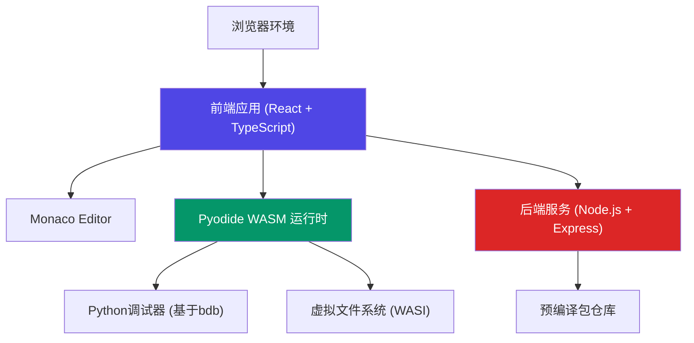

# WASM Python 运行环境与可视化调试器 - 技术架构文档

---

## 1. 系统架构总览

### 1.1 整体架构图



### 1.2 核心技术选型

| 层级 | 技术选型 | 说明 |
|------|----------|------|
| 前端框架 | React 18 + TypeScript | 类型安全、组件化开发 |
| 构建工具 | Vite | 快速开发、热更新 |
| 代码编辑器 | Monaco Editor | VS Code 同款编辑器 |
| Python运行时 | Pyodide | 基于Emscripten编译的CPython |
| 样式方案 | TailwindCSS | 原子化CSS、快速开发 |
| 状态管理 | Zustand | 轻量级状态管理 |
| 后端框架 | Express.js | 轻量级Node.js框架 |
| 本地存储 | IndexedDB | 虚拟文件系统持久化 |

---

## 2. 前端架构设计

### 2.1 目录结构

```
src/
├── components/
│   ├── editor/              # 代码编辑器组件
│   │   ├── CodeEditor.tsx   # Monaco Editor 封装
│   │   ├── Breakpoints.tsx  # 断点管理
│   │   └── LineDecorator.tsx # 行装饰器
│   ├── debugger/            # 调试器组件
│   │   ├── VariableWatch.tsx    # 变量监视器
│   │   ├── CallStack.tsx        # 调用栈
│   │   ├── DebugControls.tsx    # 调试控制按钮
│   │   └── BreakpointList.tsx   # 断点列表
│   ├── console/             # 控制台组件
│   │   └── Console.tsx      # 输出控制台
│   ├── filesystem/          # 文件系统组件
│   │   └── FileExplorer.tsx # 文件浏览器
│   └── layout/              # 布局组件
│       ├── Sidebar.tsx      # 侧边栏
│       └── Toolbar.tsx      # 工具栏
├── hooks/                   # 自定义Hooks
│   ├── usePyodide.ts        # Pyodide 管理
│   ├── useDebugger.ts       # 调试器逻辑
│   └── useFileSystem.ts     # 文件系统操作
├── stores/                  # 状态管理
│   ├── editorStore.ts       # 编辑器状态
│   ├── debuggerStore.ts     # 调试器状态
│   └── consoleStore.ts      # 控制台状态
├── services/                # 服务层
│   ├── pyodide/             # Pyodide 服务
│   │   ├── runtime.ts       # 运行时封装
│   │   └── debugger.py      # Python调试器代码
│   └── api/                 # API 服务
├── types/                   # TypeScript 类型定义
│   ├── debugger.ts          # 调试器类型
│   └── pyodide.ts           # Pyodide 类型
├── utils/                   # 工具函数
└── App.tsx                  # 应用入口
```

### 2.2 核心模块设计

#### 2.2.1 Monaco Editor 封装

**功能：**
- 代码编辑和语法高亮
- 断点设置和显示
- 当前执行行高亮
- 行号点击事件处理

**关键实现点：**
```typescript
// 核心类型定义
interface Breakpoint {
  id: string;
  lineNumber: number;
  enabled: boolean;
  condition?: string;
}

// Monaco 装饰器
const breakpointDecoration = {
  glyphMarginClassName: 'breakpoint-glyph',
  linesDecorationsClassName: 'breakpoint-line'
};
```

#### 2.2.2 Pyodide 运行时管理

**功能：**
- Pyodide 初始化和加载
- Python 代码执行
- 标准输出/错误捕获
- 包加载管理

**状态机：**
```
uninitialized → loading → ready → running → paused → stopped
                         ↓
                       error
```

#### 2.2.3 调试器核心

**功能：**
- 断点管理
- 单步执行控制
- 变量信息获取
- 调用栈追踪

**与Python交互：**
- 注入Python调试代码（基于bdb模块）
- 通过Pyodide的JavaScript桥接通信
- 使用SharedArrayBuffer或事件队列传递调试事件

---

## 3. 调试系统设计

### 3.1 调试协议

#### 3.1.1 调试事件类型

```typescript
type DebugEventType = 
  | 'started'      // 调试开始
  | 'paused'       // 命中断点/暂停
  | 'resumed'      // 继续执行
  | 'step'         // 单步完成
  | 'exception'    // 发生异常
  | 'terminated';  // 调试结束
```

#### 3.1.2 调试命令

```typescript
interface DebugCommand {
  type: 'continue' | 'step_over' | 'step_into' | 'step_out' | 'pause' | 'stop';
}
```

### 3.2 Python 调试器实现

**基于 bdb (Python Debugger Framework)：**

```python
import bdb
import sys
import json

class WASMDebugger(bdb.Bdb):
    def __init__(self):
        super().__init__()
        self.breakpoints = {}
        self.call_stack = []
        self.paused = False
        
    def user_line(self, frame):
        # 行事件处理
        self._send_event('line', frame)
        
    def user_call(self, frame, argument_list):
        # 函数调用事件
        self.call_stack.append(frame)
        self._send_event('call', frame)
        
    def user_return(self, frame, return_value):
        # 函数返回事件
        self.call_stack.pop()
        self._send_event('return', frame)
        
    def _send_event(self, event_type, frame):
        # 将事件发送到JavaScript
        event_data = {
            'type': event_type,
            'line': frame.f_lineno,
            'file': frame.f_code.co_filename,
            'locals': self._extract_locals(frame.f_locals),
            'call_stack': self._get_call_stack()
        }
        # 通过Pyodide桥接发送
```

### 3.3 变量监视器设计

**变量表示：**
```typescript
interface Variable {
  name: string;
  type: string;
  value: string;
  expanded: boolean;
  children?: Variable[];
  hasChildren: boolean;
}
```

**序列化策略：**
- 简单类型（int, str, float, bool）：直接序列化
- 容器类型（list, dict, tuple）：延迟加载子元素
- 自定义对象：显示 `__repr__` 和属性列表

---

## 4. 虚拟文件系统设计

### 4.1 WASI 集成

**技术方案：**
- 使用 Pyodide 内置的 WASI 支持
- 基于 IndexedDB 实现持久化存储
- 模拟 Unix 文件系统结构

### 4.2 文件系统 API

```typescript
interface FileSystem {
  readFile(path: string): Promise<Uint8Array>;
  writeFile(path: string, data: Uint8Array): Promise<void>;
  readdir(path: string): Promise<string[]>;
  mkdir(path: string): Promise<void>;
  unlink(path: string): Promise<void>;
  stat(path: string): Promise<FileStat>;
}
```

### 4.3 存储分层

```
Memory FS (临时)
    ↓
IndexedDB (持久化)
    ↓
用户下载/上传 (可选)
```

---

## 5. 后端服务设计

### 5.1 服务架构

```
Express Server
├── /api/packages     # 包管理API
├── /static           # 静态文件服务
└── /wasm             # WASM模块分发
```

### 5.2 预编译包管理

**包格式：**
- 基于 Pyodide 的 wheel 格式
- 包含 WASM 编译的二进制文件
- 元数据文件（版本、依赖等）

**包仓库结构：**
```
packages/
├── numpy/
│   ├── 1.24.0/
│   │   ├── numpy-1.24.0-cp311-wasm32.whl
│   │   └── metadata.json
│   └── versions.json
└── index.json
```

---

## 6. 性能优化策略

### 6.1 加载优化
- Pyodide 按需加载
- WASM 模块流式编译
- Service Worker 缓存

### 6.2 运行时优化
- 调试事件节流
- 变量延迟展开
- 虚拟列表渲染大量变量

### 6.3 编辑器优化
- Monaco Editor 配置优化
- 断点装饰器批量更新
- 语法高亮缓存

---

## 7. 安全设计

### 7.1 沙箱隔离
- WASM 内存隔离
- 文件系统访问限制
- 网络访问白名单

### 7.2 代码执行安全
- 禁用危险模块（os.system, subprocess等）
- 执行超时保护
- 内存使用限制

---

## 8. 开发与部署

### 8.1 开发环境
- Node.js 18+
- Vite Dev Server
- 热模块替换 (HMR)

### 8.2 构建流程
```
TypeScript 编译
    ↓
Vite 打包
    ↓
WASM 资源优化
    ↓
静态文件输出
```

### 8.3 部署方案
- 前端：CDN 静态托管
- 后端：Node.js 服务
- WASM 模块：单独CDN分发

---

## 9. 关键技术风险与应对

| 风险 | 影响 | 应对策略 |
|------|------|----------|
| Pyodide 加载慢 | 用户体验差 | 预加载、进度提示、Service Worker缓存 |
| 调试性能低 | 大代码调试卡顿 | 增量事件、节流、Web Worker |
| WASM 兼容性 | 旧浏览器无法使用 | 特性检测、降级提示 |
| 包体积过大 | 加载缓慢 | 按需加载、代码分割 |

