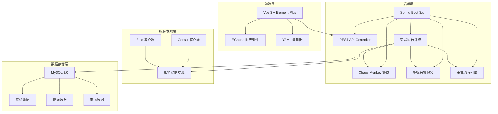

# 混沌工程实验平台 技术架构文档

## 1. 系统架构概述

### 1.1 整体架构



### 1.2 核心设计原则
- 模块化设计：各功能模块松耦合
- 可扩展性：易于添加新的故障注入类型
- 安全性：实验执行需审批，操作可审计
- 可观测性：实验全过程指标可监控

## 2. 后端技术架构

### 2.1 项目结构

```
backend/
├── src/main/java/com/chaos/platform/
│   ├── ChaosPlatformApplication.java
│   ├── config/
│   │   ├── SecurityConfig.java
│   │   ├── ConsulConfig.java
│   │   ├── EtcdConfig.java
│   │   └── ChaosMonkeyConfig.java
│   ├── controller/
│   │   ├── ExperimentController.java
│   │   ├── ApprovalController.java
│   │   ├── MetricController.java
│   │   └── ServiceDiscoveryController.java
│   ├── service/
│   │   ├── ExperimentService.java
│   │   ├── ExperimentExecutor.java
│   │   ├── ApprovalService.java
│   │   ├── MetricService.java
│   │   └── ServiceDiscoveryService.java
│   ├── repository/
│   │   ├── ExperimentRepository.java
│   │   ├── ApprovalRepository.java
│   │   └── MetricRepository.java
│   ├── entity/
│   │   ├── Experiment.java
│   │   ├── ExperimentMetric.java
│   │   ├── Approval.java
│   │   └── ServiceInstance.java
│   ├── dto/
│   │   ├── ExperimentDTO.java
│   │   ├── ExperimentConfigDTO.java
│   │   └── MetricDTO.java
│   ├── chaos/
│   │   ├── ChaosInjectionStrategy.java
│   │   ├── LatencyInjection.java
│   │   ├── PodKillInjection.java
│   │   ├── CpuLoadInjection.java
│   │   └── MemoryLoadInjection.java
│   └── exception/
│       ├── ExperimentException.java
│       └── GlobalExceptionHandler.java
└── src/main/resources/
    ├── application.yml
    └── schema.sql
```

### 2.2 核心模块说明

#### 2.2.1 实验管理模块
- **ExperimentController**: 实验CRUD操作API
- **ExperimentService**: 实验业务逻辑
- **ExperimentExecutor**: 实验执行引擎，负责生命周期管理
- **状态流转**: PENDING -> APPROVED -> RUNNING -> COMPLETED/FAILED/ROLLED_BACK

#### 2.2.2 故障注入模块
- **ChaosInjectionStrategy**: 故障注入策略接口
- **LatencyInjection**: 延迟注入实现
- **PodKillInjection**: Pod杀掉实现
- **CpuLoadInjection**: CPU负载注入
- **MemoryLoadInjection**: 内存负载注入

#### 2.2.3 服务发现模块
- **ConsulConfig**: Consul客户端配置
- **EtcdConfig**: Etcd客户端配置
- **ServiceDiscoveryService**: 统一服务发现接口

#### 2.2.4 审批流程模块
- **ApprovalController**: 审批API
- **ApprovalService**: 审批业务逻辑
- 状态：PENDING -> APPROVED/REJECTED

#### 2.2.5 指标采集模块
- **MetricService**: 指标采集与存储
- 业务指标：RPS、P99延迟、错误率
- 系统指标：CPU使用率、内存使用率

## 3. 前端技术架构

### 3.1 项目结构

```
frontend/
├── src/
│   ├── api/
│   │   ├── experiment.js
│   │   ├── approval.js
│   │   ├── metric.js
│   │   └── service.js
│   ├── components/
│   │   ├── MetricChart.vue
│   │   ├── YamlEditor.vue
│   │   ├── ExperimentStatus.vue
│   │   └── ServiceSelect.vue
│   ├── views/
│   │   ├── Dashboard.vue
│   │   ├── ExperimentList.vue
│   │   ├── ExperimentDetail.vue
│   │   ├── CreateExperiment.vue
│   │   ├── ApprovalCenter.vue
│   │   └── ServiceManagement.vue
│   ├── router/
│   │   └── index.js
│   ├── store/
│   │   └── index.js
│   ├── utils/
│   │   ├── request.js
│   │   └── format.js
│   ├── App.vue
│   └── main.js
├── public/
│   └── index.html
├── package.json
└── vite.config.js
```

### 3.2 核心组件说明

#### 3.2.1 页面组件
- **Dashboard**: 系统仪表盘，展示实验统计和关键指标
- **ExperimentList**: 实验列表，支持筛选和搜索
- **ExperimentDetail**: 实验详情，包含实时图表和执行日志
- **CreateExperiment**: 创建实验，YAML编辑器+表单
- **ApprovalCenter**: 审批中心，管理员审批实验
- **ServiceManagement**: 服务管理，展示已发现的服务

#### 3.2.2 通用组件
- **MetricChart**: ECharts封装的指标图表组件
- **YamlEditor**: YAML配置编辑器
- **ExperimentStatus**: 实验状态展示组件
- **ServiceSelect**: 服务选择下拉框

## 4. 数据库设计

### 4.1 核心表结构

#### 4.1.1 experiments 实验表
| 字段名 | 类型 | 说明 |
|--------|------|------|
| id | BIGINT | 主键 |
| experiment_id | VARCHAR(64) | 唯一实验ID |
| name | VARCHAR(128) | 实验名称 |
| description | TEXT | 实验描述 |
| config_yaml | TEXT | YAML配置内容 |
| status | VARCHAR(32) | 状态：PENDING/APPROVED/RUNNING/COMPLETED/FAILED |
| creator_id | BIGINT | 创建人ID |
| start_time | DATETIME | 开始时间 |
| end_time | DATETIME | 结束时间 |
| created_at | DATETIME | 创建时间 |
| updated_at | DATETIME | 更新时间 |

#### 4.1.2 experiment_metrics 指标表
| 字段名 | 类型 | 说明 |
|--------|------|------|
| id | BIGINT | 主键 |
| experiment_id | VARCHAR(64) | 实验ID |
| metric_type | VARCHAR(32) | 指标类型 |
| metric_name | VARCHAR(64) | 指标名称 |
| value | DECIMAL | 指标值 |
| timestamp | DATETIME | 采集时间 |
| phase | VARCHAR(32) | 阶段：BEFORE/DURING/AFTER |

#### 4.1.3 approvals 审批表
| 字段名 | 类型 | 说明 |
|--------|------|------|
| id | BIGINT | 主键 |
| experiment_id | VARCHAR(64) | 实验ID |
| applicant_id | BIGINT | 申请人ID |
| approver_id | BIGINT | 审批人ID |
| status | VARCHAR(32) | 状态：PENDING/APPROVED/REJECTED |
| reason | TEXT | 审批意见 |
| created_at | DATETIME | 创建时间 |
| approved_at | DATETIME | 审批时间 |

#### 4.1.4 service_instances 服务实例表
| 字段名 | 类型 | 说明 |
|--------|------|------|
| id | BIGINT | 主键 |
| service_name | VARCHAR(128) | 服务名称 |
| host | VARCHAR(128) | 主机地址 |
| port | INT | 端口 |
| source | VARCHAR(32) | 来源：CONSUL/ETCD/MANUAL |
| health_status | VARCHAR(32) | 健康状态 |
| last_checked | DATETIME | 最后检查时间 |

## 5. YAML实验配置规范

### 5.1 配置示例

```yaml
apiVersion: chaos.platform/v1
kind: ChaosExperiment
metadata:
  name: order-service-latency
  description: 对订单服务注入5秒延迟
spec:
  target:
    serviceDiscovery: consul
    serviceName: order-service
    instances: all
  
  chaosType: latency
  duration: 300s
  autoRollback: true
  
  latencyConfig:
    latencyMs: 5000
    percentage: 100
  
  rollbackConditions:
    errorRateThreshold: 50
    timeoutSeconds: 600
  
  metrics:
    - name: rps
      source: prometheus
      query: rate(http_requests_total[1m])
    - name: p99_latency
      source: prometheus
      query: histogram_quantile(0.99, rate(http_request_duration_seconds_bucket[1m]))
    - name: error_rate
      source: prometheus
      query: rate(http_requests_total{status=~"5.."}[1m])
```

### 5.2 支持的故障类型
- **latency**: 延迟注入
- **podKill**: Pod杀掉
- **cpuLoad**: CPU负载
- **memoryLoad**: 内存负载
- **exception**: 异常注入

## 6. API接口设计

### 6.1 实验管理接口
- `GET /api/experiments` - 获取实验列表
- `GET /api/experiments/{id}` - 获取实验详情
- `POST /api/experiments` - 创建实验
- `PUT /api/experiments/{id}` - 更新实验
- `DELETE /api/experiments/{id}` - 删除实验
- `POST /api/experiments/{id}/start` - 开始实验
- `POST /api/experiments/{id}/stop` - 停止实验（回滚）

### 6.2 审批接口
- `GET /api/approvals/pending` - 获取待审批列表
- `POST /api/approvals/{id}/approve` - 审批通过
- `POST /api/approvals/{id}/reject` - 审批拒绝

### 6.3 指标接口
- `GET /api/metrics/experiment/{id}` - 获取实验指标
- `GET /api/metrics/experiment/{id}/realtime` - 实时指标

### 6.4 服务发现接口
- `GET /api/services` - 获取所有服务
- `GET /api/services/{name}/instances` - 获取服务实例

## 7. 安全设计

### 7.1 认证授权
- JWT Token认证
- 角色权限控制（USER/ADMIN）
- 实验操作权限校验

### 7.2 实验安全
- 审批机制防止误操作
- 自动回滚阈值保护
- 实验超时自动终止
- 操作审计日志

## 8. 部署架构

### 8.1 容器化部署
- Docker镜像构建
- Kubernetes部署
- 数据库独立部署

### 8.2 高可用设计
- 后端服务多实例部署
- 数据库主从复制
- 实验执行状态持久化
