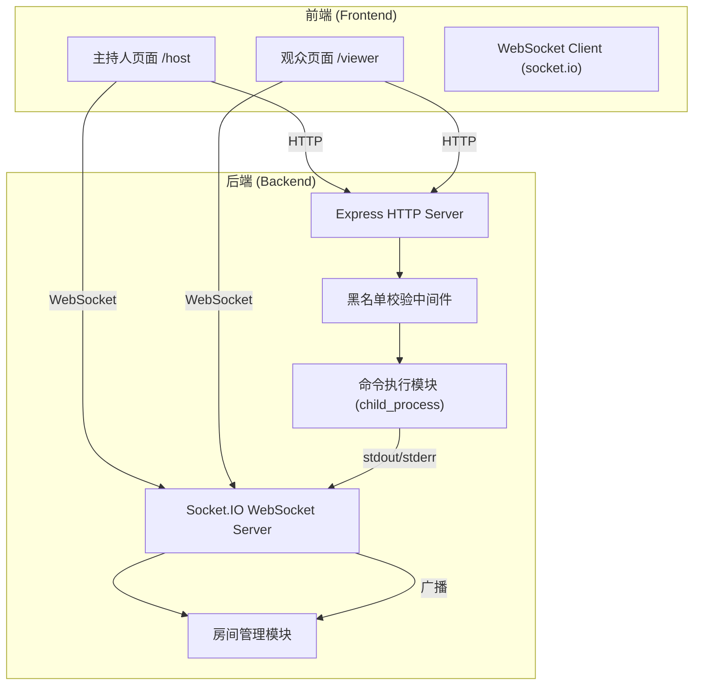
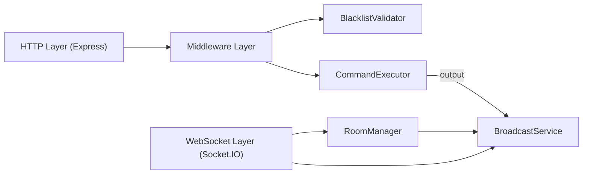

## 1. 架构设计



## 2. 技术描述

- 前端：React@18 + tailwindcss@3 + vite + socket.io-client
- 初始化工具：vite-init
- 后端：Express@4 + Socket.IO@4 + Node.js child_process
- 数据库：无（内存管理房间状态）

## 3. 路由定义

| 路由 | 用途 |
|------|------|
| /host | 主持人页面，输入并执行命令 |
| /viewer | 观众页面，只读查看输出 |
| /api/execute | 命令执行API（POST） |
| /socket.io | Socket.IO连接端点 |

## 4. API 定义

### 4.1 命令执行接口

```typescript
// 请求
interface ExecuteCommandRequest {
  command: string;
  room: string;
}

// 响应
interface ExecuteCommandResponse {
  success: boolean;
  message?: string;
  executionId?: string;
}
```

### 4.2 WebSocket 事件

```typescript
// 客户端发送
interface JoinRoomEvent {
  type: 'join';
  room: string;
  role: 'host' | 'viewer';
}

// 服务端广播
interface OutputEvent {
  type: 'stdout' | 'stderr' | 'system';
  data: string;
  timestamp: number;
  room: string;
}

interface ExecutionStatusEvent {
  type: 'execution_start' | 'execution_end';
  executionId: string;
  room: string;
  exitCode?: number;
}
```

## 5. 服务器架构



## 6. 数据模型

### 6.1 房间状态（内存存储）

```typescript
interface Room {
  id: string;
  hostId?: string;
  viewers: string[];
  outputHistory: OutputEvent[];
  isExecuting: boolean;
}

interface Connection {
  id: string;
  roomId: string;
  role: 'host' | 'viewer';
  socketId: string;
}
```

### 6.2 命令黑名单

```typescript
const BLACKLIST = [
  'rm -rf /',
  'sudo',
  'shutdown',
  'reboot',
  'halt',
  'poweroff',
  'mkfs',
  'dd if=',
  ':(){:|:&};:',
  '> /dev/sda',
  'wget',
  'curl',
  'chmod 777',
  'chown -R',
];
```

## 7. 安全措施

1. **命令黑名单**：正则匹配危险命令模式
2. **执行超时**：默认10秒超时，防止长时间阻塞
3. **沙箱执行**：限制执行权限，避免高危操作
4. **输入长度限制**：命令最大长度1024字符
5. **角色权限**：仅主持人可执行命令
