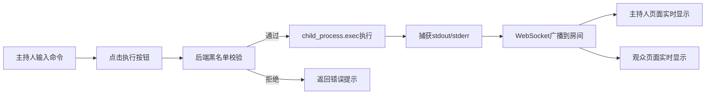

## 1. 产品概述

实时命令执行与展示系统，支持主持人通过Web界面输入Shell命令并执行，命令输出通过WebSocket实时推送给同一房间内的所有观众。

- 主要用途：教学演示、技术分享、实时协作场景
- 核心价值：实现命令执行过程的实时可视化展示，增强互动性和参与感

## 2. 核心功能

### 2.1 用户角色

| 角色 | 进入方式 | 核心权限 |
|------|----------|----------|
| 主持人 | URL路径 `/host?room=xxx` | 输入并执行命令，实时查看输出 |
| 观众 | URL路径 `/viewer?room=xxx` | 只读查看命令执行的实时输出流 |

### 2.2 功能模块

1. **主持人页面**：命令输入区、执行按钮、实时输出展示
2. **观众页面**：只读输出展示区、房间信息显示
3. **后端服务**：命令执行、WebSocket推送、黑名单校验
4. **房间机制**：基于URL参数的房间隔离

### 2.3 页面详情

| 页面名称 | 模块名称 | 功能描述 |
|----------|----------|----------|
| 主持人页面 | 命令输入区 | 多行文本框输入Shell命令，支持换行 |
| 主持人页面 | 执行控制 | 执行按钮、清空输出按钮、命令执行状态提示 |
| 主持人页面 | 输出展示区 | 实时显示stdout和stderr，区分不同输出类型 |
| 观众页面 | 输出展示区 | 只读展示命令执行的实时输出流 |
| 观众页面 | 状态提示 | 显示连接状态、房间信息、在线人数 |

## 3. 核心流程

主持人在textarea输入命令，点击执行按钮，后端校验命令黑名单后通过child_process.exec执行，stdout和stderr实时通过WebSocket广播给同房间的所有连接客户端。

## 4. 用户界面设计

### 4.1 设计风格

- 主色调：深科技风格，深蓝底色 #0a192f 配霓虹青 #64ffda
- 按钮样式：圆角矩形，悬浮发光效果
- 字体：等宽字体 JetBrains Mono 用于代码输出，Inter 用于界面文字
- 布局风格：终端模拟器风格，分栏布局，左侧输入右侧输出
- 图标风格：简约线性图标，使用emoji增强视觉效果

### 4.2 页面设计概述

| 页面名称 | 模块名称 | UI元素 |
|----------|----------|--------|
| 主持人页面 | 头部 | 房间号显示、角色标识、在线人数 |
| 主持人页面 | 命令输入 | 深色textarea、行号、语法高亮感 |
| 主持人页面 | 输出区域 | 滚动终端、stdout绿色文字、stderr红色文字 |
| 观众页面 | 头部 | 房间号、连接状态指示灯 |
| 观众页面 | 输出区域 | 全屏终端展示、时间戳、自动滚动 |

### 4.3 响应性

- 桌面端优先设计，左右分栏布局
- 移动端自适应为上下布局
- 触摸设备优化按钮尺寸和滚动体验

### 4.4 动效设计

- 命令执行时的打字机动效
- 新输出行的淡入动画
- WebSocket连接状态的呼吸灯效果
- 按钮悬浮时的微缩放和发光
