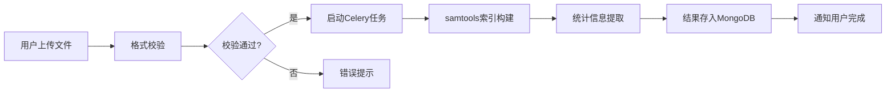

## 1. 产品概述

基因组数据可视化与注释平台是一个专业的生物信息学分析工具，为科研人员和临床医生提供高通量测序数据的交互式可视化、变异注释和样本比较功能。平台支持BAM/VCF标准格式文件的拖拽上传，通过直观的基因组浏览器展示染色体分布、reads覆盖深度和变异位点，助力癌症基因组学研究和精准医学诊断。

### 1.1 产品目标
- 降低基因组数据分析的技术门槛，让生物学家无需编程即可探索测序数据
- 提供GB级大文件的高效处理，支持实时区域查询和可视化
- 整合多个权威数据库的变异注释信息，辅助临床决策
- 支持肿瘤-正常样本配对分析，精准识别体细胞突变

### 1.2 目标用户
- 高校和科研院所的基因组学研究人员
- 医院检验科和病理科医生
- 生物科技公司的测序数据分析人员
- 精准医学相关领域的临床研究者

## 2. 核心功能

### 2.1 用户角色
| 角色 | 注册方式 | 核心权限 |
|------|----------|----------|
| 普通用户 | 邮箱/手机号注册 | 上传文件、可视化浏览、基础注释、导出结果 |
| 高级用户 | 机构认证 | 多样本比较、批量注释、API调用、优先任务处理 |
| 管理员 | 系统分配 | 用户管理、系统监控、数据库更新、配额管理 |

### 2.2 功能模块
1. **基因组浏览器**：交互式染色体视图、reads覆盖深度图、变异位点标记、缩放平移
2. **文件管理**：BAM/VCF拖拽上传、文件列表、进度显示、格式验证
3. **变异注释**：数据库交叉注释(ClinVar/dbSNP/COSMIC)、功能影响预测(SIFT/PolyPhen)
4. **样本比较**：肿瘤-正常样本配对、体细胞突变高亮、差异变异筛选
5. **任务中心**：异步任务状态、处理进度、历史记录
6. **结果导出**：注释报告下载、可视化截图、变异列表导出

### 2.3 页面详情
| 页面名称 | 模块名称 | 功能描述 |
|----------|----------|----------|
| 工作台 | 基因组浏览器主视图 | PixiJS渲染的交互式基因组视图，支持缩放、平移、位点点击 |
|  | 文件上传区 | 拖拽上传BAM/VCF文件，显示上传进度和格式校验 |
|  | 控制面板 | 染色体选择、坐标定位、显示轨道配置、样本切换 |
| 样本管理 | 文件列表 | 已上传文件列表，支持搜索、筛选、删除 |
|  | 文件详情 | 文件统计信息、QC指标、处理历史 |
| 变异注释 | 变异详情弹窗 | 点击变异位点显示完整注释信息、数据库交叉引用 |
|  | 功能预测 | SIFT/PolyPhen评分、保守性分析、蛋白质结构影响 |
| 样本比较 | 双轨道视图 | 同时展示正常和肿瘤样本的覆盖度和变异 |
|  | 体细胞突变高亮 | 差异变异标记、突变频谱分析、VAF分布对比 |
| 任务中心 | 任务列表 | Celery异步任务状态、进度条、失败重试 |
|  | 任务详情 | 处理日志、耗时统计、结果文件链接 |

## 3. 核心流程

### 3.1 数据上传与处理流程
用户拖拽BAM/VCF文件到上传区，系统进行格式校验后启动Celery异步任务，调用samtools/bcftools建立索引并提取统计信息，处理完成后通知用户可进行可视化浏览。

### 3.2 变异注释流程
用户在基因组浏览器中点击变异位点，前端向后端发起注释请求，系统查询本地MongoDB缓存的注释信息，如缺失则调用ENSEMBL REST API获取功能预测结果，缓存后返回给前端展示。

### 3.3 样本比较流程
用户选择正常样本和肿瘤样本进行配对，系统并行提取两个样本的变异数据，进行基因型比较，识别体细胞突变并在双轨道视图中高亮显示，支持过滤和导出。

## 4. 用户界面设计

### 4.1 设计风格
- **主色调**：深空蓝(#165DFF) - 代表科技感和专业度
- **辅助色**：基因绿(#00B42A)、突变红(#F53F3F)、警示橙(#FF7D00)
- **中性色**：深灰(#1D2129)、中灰(#4E5969)、浅灰(#C9CDD4)
- **按钮风格**：圆角8px，悬停微动效，主按钮蓝色渐变
- **字体**：JetBrains Mono(代码/数字) + Noto Sans SC(中文)
- **布局风格**：左右分栏，左侧工具栏+右侧浏览器主视图，卡片式信息面板
- **图标风格**：线性图标，基因组学相关元素(DNA双螺旋、染色体、显微镜)

### 4.2 页面设计概览
| 页面名称 | 模块名称 | UI元素 |
|----------|----------|--------|
| 工作台 | 基因组浏览器 | PixiJS Canvas画布、染色体概览条、坐标标尺、覆盖度波形、变异标记点 |
|  | 左侧工具栏 | 文件选择器、轨道配置、显示选项、缩放控制、快捷按钮 |
|  | 底部信息栏 | 当前坐标、选中区域、鼠标位置、统计数据 |
| 变异详情 | 注释弹窗 | 基因名称、变异类型、数据库标签、功能预测评分、参考文献链接 |
| 样本比较 | 双轨道视图 | 上下排列的两个基因组视图、同步缩放平移、差异连线高亮 |

### 4.3 响应式设计
- **桌面端优先**：针对1920×1080及以上分辨率优化，基因组浏览器占据主要屏幕空间
- **平板适配**：工具栏可折叠，信息面板改为底部抽屉式
- **触摸优化**：支持双指缩放、长按选中、滑动平移
- **大屏幕支持**：2K/4K分辨率下自动调整字体和元素大小

### 4.4 交互动效
- **页面加载**：DNA双螺旋加载动画，进度条随文件处理进度延伸
- **悬停效果**：变异位点悬停显示预览信息框，平滑淡入
- **转场动画**：面板切换使用滑动过渡，模态框使用缩放+淡入
- **数据更新**：新注释结果出现时使用脉冲动画吸引注意力

## 5. 非功能需求

### 5.1 性能要求
- 支持GB级别BAM文件的区域查询，响应时间<3秒
- 基因组浏览器60fps渲染，支持百万级reads点可视化
- 异步任务队列支持并发100+任务
- MongoDB注释查询响应时间<100ms

### 5.2 安全要求
- 用户数据隔离，每个用户只能访问自己上传的文件
- 传输过程HTTPS加密，敏感数据脱敏
- API接口JWT认证，请求频率限制
- 定期备份，支持数据恢复

### 5.3 兼容性要求
- 支持Chrome、Firefox、Safari、Edge最新版本
- 后端部署支持Docker容器化
- 支持Windows/Linux/macOS操作系统访问
