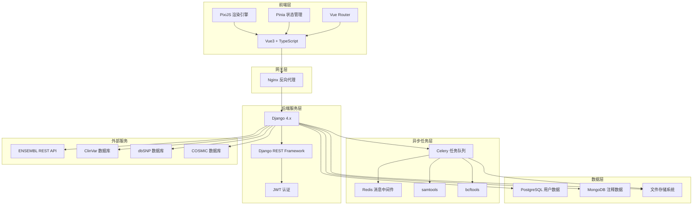
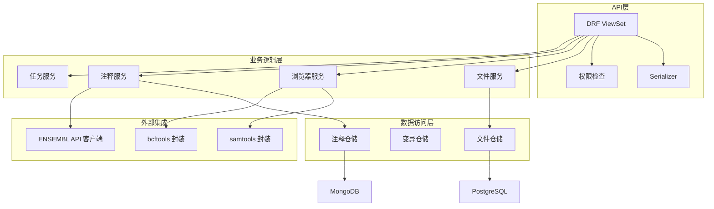
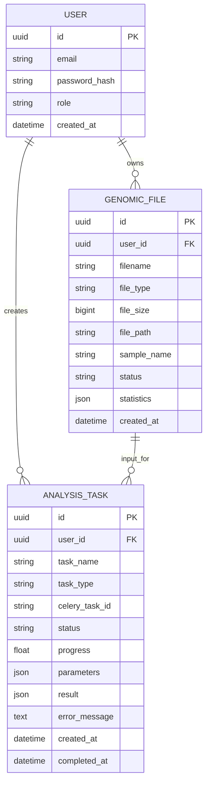

## 1. 架构设计



## 2. 技术选型说明

### 2.1 前端技术栈
- **框架**: Vue 3.4.x + TypeScript 5.x
- **构建工具**: Vite 5.x
- **渲染引擎**: PixiJS 7.x (高性能2D渲染)
- **状态管理**: Pinia 2.x
- **路由**: Vue Router 4.x
- **UI组件**: Element Plus 2.x
- **图表**: ECharts 5.x (统计图表)
- **HTTP客户端**: Axios
- **样式**: SCSS + Tailwind CSS 3

### 2.2 后端技术栈
- **Web框架**: Django 4.2.x
- **API框架**: Django REST Framework 3.14.x
- **认证**: djangorestframework-simplejwt
- **异步任务**: Celery 5.x + Redis
- **数据库驱动**: 
  - psycopg2-binary (PostgreSQL)
  - pymongo (MongoDB)
- **生物信息学工具**:
  - pysam (Python封装samtools)
  - cyvcf2 (高效VCF解析)

### 2.3 数据存储
- **PostgreSQL 15**: 用户信息、文件元数据、任务状态
- **MongoDB 6.x**: 变异注释结果、缓存数据
- **Redis 7.x**: Celery消息队列、缓存
- **文件系统**: 原始BAM/VCF文件存储

### 2.4 部署架构
- **Docker + Docker Compose** 容器化部署
- **Nginx** 静态文件服务 + 反向代理
- **Gunicorn + Uvicorn** ASGI服务器

## 3. 项目目录结构

```
genome-browser/
├── frontend/                    # 前端Vue3项目
│   ├── src/
│   │   ├── components/
│   │   │   ├── GenomeBrowser/   # PixiJS基因组浏览器
│   │   │   ├── FileUpload/      # 文件上传组件
│   │   │   ├── VariantDetail/   # 变异详情弹窗
│   │   │   └── SampleCompare/   # 样本比较组件
│   │   ├── stores/              # Pinia状态管理
│   │   ├── api/                 # API接口封装
│   │   ├── utils/               # 工具函数
│   │   └── views/               # 页面视图
│   └── package.json
├── backend/                     # 后端Django项目
│   ├── config/                  # Django配置
│   ├── apps/
│   │   ├── accounts/            # 用户管理
│   │   ├── files/               # 文件管理
│   │   ├── browser/             # 基因组浏览器API
│   │   ├── annotation/          # 变异注释
│   │   └── tasks/               # Celery任务
│   ├── requirements.txt
│   └── manage.py
├── docker/                      # Docker配置
├── .trae/documents/             # 项目文档
└── README.md
```

## 4. 路由定义

### 4.1 前端路由
| 路由路径 | 页面名称 | 功能说明 |
|----------|----------|----------|
| `/` | 工作台首页 | 基因组浏览器主界面 |
| `/files` | 文件管理 | 已上传文件列表管理 |
| `/compare` | 样本比较 | 肿瘤-正常样本配对分析 |
| `/tasks` | 任务中心 | 异步任务状态监控 |
| `/annotations` | 注释库 | 变异注释数据库浏览 |

### 4.2 后端API路由
| 路由 | 方法 | 功能说明 |
|------|------|----------|
| `/api/auth/login/` | POST | 用户登录 |
| `/api/files/` | GET/POST | 文件列表/上传 |
| `/api/files/{id}/` | GET/DELETE | 文件详情/删除 |
| `/api/browser/region/` | GET | 区域数据查询 |
| `/api/browser/coverage/` | GET | 覆盖深度数据 |
| `/api/variants/{id}/` | GET | 变异详情 |
| `/api/variants/{id}/annotate/` | POST | 变异注释 |
| `/api/tasks/{id}/` | GET | 任务状态查询 |
| `/api/compare/` | POST | 样本比较分析 |

## 5. API数据定义

### 5.1 TypeScript 类型定义

```typescript
// 文件信息
interface GenomicFile {
  id: string;
  name: string;
  type: 'BAM' | 'VCF';
  size: number;
  status: 'uploading' | 'processing' | 'ready' | 'error';
  sampleName: string;
  createdAt: string;
  statistics?: FileStatistics;
}

interface FileStatistics {
  totalReads: number;
  mappedReads: number;
  averageCoverage: number;
  variantCount: number;
}

// 基因组区域数据
interface RegionData {
  chromosome: string;
  start: number;
  end: number;
  coverage: CoveragePoint[];
  variants: Variant[];
  reads: Read[];
}

interface CoveragePoint {
  position: number;
  depth: number;
}

interface Variant {
  id: string;
  chromosome: string;
  position: number;
  ref: string;
  alt: string;
  quality: number;
  filter: string;
  type: 'SNP' | 'INS' | 'DEL';
  annotations?: VariantAnnotation;
}

interface VariantAnnotation {
  gene: string;
  consequence: string;
  clinvar?: ClinVarInfo;
  dbsnp?: string;
  cosmic?: string;
  sift?: ScorePrediction;
  polyphen?: ScorePrediction;
}

interface ScorePrediction {
  score: number;
  prediction: 'tolerated' | 'deleterious';
}

// 任务状态
interface Task {
  id: string;
  name: string;
  status: 'PENDING' | 'STARTED' | 'SUCCESS' | 'FAILURE';
  progress: number;
  result?: any;
  error?: string;
}
```

## 6. 服务器架构



## 7. 数据模型

### 7.1 PostgreSQL 数据模型



### 7.2 MongoDB 数据模型

```javascript
// variants 集合 - 变异注释缓存
{
  _id: ObjectId,
  variant_key: "chr1:12345:A>T",  // 唯一键
  chromosome: "chr1",
  position: 12345,
  ref: "A",
  alt: "T",
  gene: "BRCA1",
  transcript: "ENST00000357654",
  consequence: "missense_variant",
  clinvar: {
    variation_id: "VCV000012345",
    clinical_significance: "Pathogenic",
    conditions: ["Breast cancer"]
  },
  dbsnp: "rs12345678",
  cosmic: "COSV12345678",
  sift: {
    score: 0.01,
    prediction: "deleterious"
  },
  polyphen: {
    score: 0.98,
    prediction: "probably_damaging"
  },
  last_updated: ISODate("2024-01-01T00:00:00Z")
}
```

## 8. 关键技术方案

### 8.1 PixiJS 基因组浏览器渲染方案
- 使用 **Container 分层渲染**:
  - 背景层: 染色体坐标标尺
  - 覆盖度层: 深度波形图 (Graphics 绘制)
  - Reads层: 百万级reads粒子渲染 (使用ParticleContainer优化)
  - 变异层: 变异位点标记 (Sprite + 交互事件)
  - 信息层: 悬停提示、选中高亮
- **视口优化**: 仅渲染可视区域数据，动态加载
- **LOD策略**: 不同缩放级别显示不同细节层次

### 8.2 大文件处理方案
- **流式上传**: 分片上传，断点续传
- **索引构建**: Celery异步调用samtools index
- **区域查询**: 使用tabix索引快速提取指定区域
- **内存优化**: 分块处理，避免一次性加载整个文件

### 8.3 注释缓存策略
- **MongoDB TTL索引**: 注释结果缓存30天
- **批量预注释**: 热门变异位点预先注释
- **LRU缓存**: 内存缓存高频查询结果

## 9. 初始化命令

### 后端初始化
```bash
# 创建Django项目
django-admin startproject config backend
cd backend
python manage.py startapp accounts
python manage.py startapp files
python manage.py startapp browser
python manage.py startapp annotation
python manage.py startapp tasks
```

### 前端初始化
```bash
npm create vite@latest frontend -- --template vue-ts
cd frontend
npm install pixi.js pinia vue-router element-plus axios
npm install -D tailwindcss postcss autoprefixer
```
