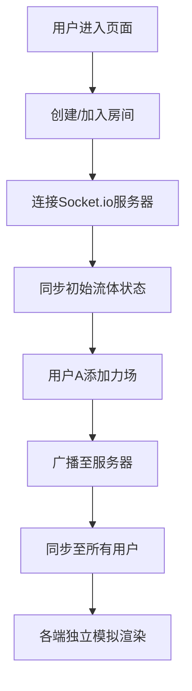

## 1. 产品概述

基于WebGPU的实时流体模拟系统，实现高性能的物理流体仿真与可视化。系统采用欧拉方法求解Navier-Stokes方程，支持多人实时协作交互，可应用于科学可视化、游戏特效、教育演示等场景。

- **核心目标**：在浏览器中实现256x256网格分辨率下稳定60fps的流体模拟
- **目标用户**：科研人员、设计师、教育工作者、技术爱好者
- **市场价值**：填补Web端高性能流体模拟工具的空白，无需安装即可使用

## 2. 核心特性

### 2.1 用户角色

| 角色 | 注册方式 | 核心权限 |
|------|---------|----------|
| 普通用户 | 无需注册，自动分配会话ID | 使用流体模拟、添加力场、导出数据 |
| 协作用户 | 加入房间，输入昵称 | 多人同时在同一流体场中添加力场 |

### 2.2 功能模块

1. **流体模拟主界面**：WebGPU流体场渲染、控制面板、性能统计
2. **交互控制系统**：鼠标/手势追踪力场添加（吸引、排斥、旋涡）
3. **可视化模式**：粒子轨迹、速度场流线、涡量等值面三种渲染模式
4. **多人协作模块**：房间创建、用户列表、实时力场同步
5. **数据导出模块**：VTK格式导出，支持ParaView后处理

### 2.3 页面详情

| 页面名称 | 模块名称 | 功能描述 |
|---------|---------|----------|
| 主界面 | 流体渲染区域 | 全屏WebGPU流体场渲染，支持鼠标交互 |
| 主界面 | 控制面板 | 模拟参数调节（粘度、速度、颜色），力场类型切换 |
| 主界面 | 性能面板 | FPS、GPU内存、模拟耗时实时显示 |
| 主界面 | 协作面板 | 房间列表、用户列表、房间创建/加入 |
| 主界面 | 导出面板 | VTK导出配置，分辨率、时间步长选择 |

## 3. 核心流程

### 3.1 单人模拟流程
1. 用户进入页面，系统自动初始化WebGPU和流体求解器
2. 用户通过鼠标拖拽在流体场中添加力场
3. 系统实时计算流体运动并渲染
4. 用户可切换可视化模式、调节参数
5. 用户可导出当前模拟状态为VTK文件

### 3.2 多人协作流程

## 4. 用户界面设计

### 4.1 设计风格
- **主色调**：深空蓝 (#0a1628) 作为背景，搭配流体渐变色彩（青蓝→紫色→橙红）
- **辅助色**：霓虹青色 (#00f5ff) 用于交互元素和高亮
- **字体**：展示字体使用 Space Grotesk，正文字体使用 JetBrains Mono
- **视觉风格**：赛博朋克科技风，深色主题，霓虹光效，玻璃态面板

### 4.2 页面设计概要

| 页面名称 | 模块名称 | UI元素 |
|---------|---------|--------|
| 主界面 | 流体渲染区 | 全屏画布，鼠标光标变为力场指示器，粒子拖尾效果 |
| 主界面 | 控制面板 | 左侧悬浮玻璃态面板，滑块、切换按钮、下拉选择器 |
| 主界面 | 性能面板 | 右上角迷你面板，FPS折线图，数值实时更新 |
| 主界面 | 协作面板 | 右侧可折叠面板，用户头像列表，房间号展示 |

### 4.3 响应式设计
- 桌面端：三栏布局，左右控制面板，中间渲染区
- 平板端：控制面板可折叠，默认隐藏
- 移动端：仅保留核心渲染区，控制面板通过底部抽屉呼出

### 4.4 3D场景设计
- **环境**：深色太空背景，微弱星云粒子效果
- **光照**：环境光 + 方向光，流体自发光材质
- **相机**：正交投影，固定视角俯瞰流体场
- **后期处理**：Bloom发光效果，轻微色差，FXAA抗锯齿
