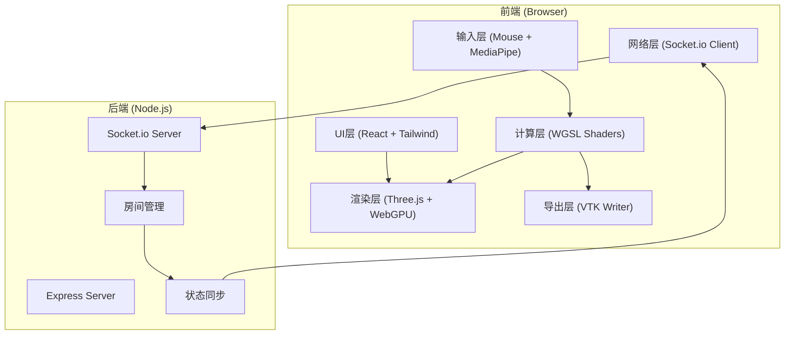
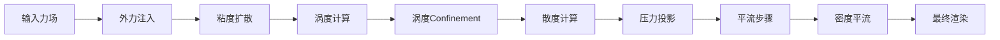

## 1. 架构设计



## 2. 技术栈描述

### 2.1 前端技术栈
- **框架**：React 18 + TypeScript + Vite
- **渲染引擎**：Three.js r160 + WebGPU Renderer
- **状态管理**：Zustand
- **样式**：Tailwind CSS 3
- **计算着色器**：WebGPU + WGSL
- **手部追踪**：MediaPipe Hands
- **网络通信**：Socket.io Client 4.x
- **图标**：Lucide React

### 2.2 后端技术栈
- **运行时**：Node.js 20+
- **Web框架**：Express 4.x
- **实时通信**：Socket.io 4.x
- **语言**：TypeScript

### 2.3 核心算法
- **流体求解器**：基于Navier-Stokes方程的欧拉方法
  - 平流步骤 (Advection)：半拉格朗日方法
  - 投影步骤 (Projection)：共轭梯度法求解泊松方程
  - 涡度 confinement (Vorticity Confinement)：保持流体细节
  - 粘度扩散 (Viscosity Diffusion)：显式/隐式方法

## 3. 目录结构

```
e:\soloJ\j39
├── src/
│   ├── components/          # React组件
│   │   ├── ControlPanel/    # 控制面板
│   │   ├── PerformancePanel/ # 性能面板
│   │   ├── CollaborationPanel/ # 协作面板
│   │   └── ExportPanel/     # 导出面板
│   ├── hooks/               # 自定义Hooks
│   │   ├── useFluidSolver.ts # 流体求解器Hook
│   │   ├── useHandTracking.ts # 手部追踪Hook
│   │   └── useSocket.ts     # Socket连接Hook
│   ├── engine/              # 流体引擎核心
│   │   ├── FluidSolver.ts   # 求解器主类
│   │   ├── WebGPURenderer.ts # WebGPU渲染器
│   │   └── shaders/         # WGSL着色器
│   │       ├── advection.wgsl
│   │       ├── pressure.wgsl
│   │       ├── vorticity.wgsl
│   │       ├── divergence.wgsl
│   │       └── render.wgsl
│   ├── utils/               # 工具函数
│   │   ├── vtkExporter.ts   # VTK导出器
│   │   └── math.ts          # 数学工具
│   ├── store/               # Zustand状态
│   │   └── useAppStore.ts
│   ├── types/               # TypeScript类型
│   │   └── index.ts
│   ├── pages/               # 页面
│   │   └── Index.tsx
│   ├── App.tsx
│   └── main.tsx
├── api/                     # 后端代码
│   ├── index.ts             # 服务入口
│   ├── types.ts             # 共享类型
│   └── roomManager.ts       # 房间管理
├── shared/                  # 前后端共享类型
│   └── index.ts
├── package.json
├── tsconfig.json
├── vite.config.ts
└── tailwind.config.js
```

## 4. 核心数据结构

### 4.1 流体场数据
```typescript
interface FluidField {
  resolution: number;          // 网格分辨率 (256)
  velocity: GPUTexture;        // 速度场 (RG32F)
  pressure: GPUTexture;        // 压力场 (R32F)
  density: GPUTexture;         // 密度场 (RGBA32F)
  vorticity: GPUTexture;       // 涡量场 (R32F)
  divergence: GPUTexture;      // 散度场 (R32F)
}
```

### 4.2 力场数据
```typescript
interface ForceField {
  id: string;
  userId: string;
  type: 'attract' | 'repel' | 'vortex';
  position: { x: number; y: number };
  strength: number;
  radius: number;
  timestamp: number;
}
```

### 4.3 房间数据
```typescript
interface Room {
  id: string;
  name: string;
  users: User[];
  forceFields: ForceField[];
  createdAt: number;
}

interface User {
  id: string;
  name: string;
  color: string;
  connectedAt: number;
}
```

## 5. API 定义 (Socket.io)

### 5.1 客户端事件
```typescript
// 发送事件
client.emit('create_room', { name: string });
client.emit('join_room', { roomId: string, userName: string });
client.emit('leave_room', { roomId: string });
client.emit('force_field', { roomId: string, force: ForceField });
client.emit('request_sync', { roomId: string });

// 监听事件
client.on('room_created', (room: Room) => void);
client.on('user_joined', (user: User) => void);
client.on('user_left', (userId: string) => void);
client.on('force_field', (force: ForceField) => void);
client.on('sync_state', (state: { forceFields: ForceField[] }) => void);
client.on('room_list', (rooms: Room[]) => void);
```

### 5.2 HTTP API
```typescript
GET /api/rooms - 获取房间列表
POST /api/export - 导出VTK文件 (接收二进制数据)
```

## 6. 性能优化策略

### 6.1 GPU优化
- **纹理格式**：使用 R32F / RG32F 减少内存带宽
- **Ping-Pong 渲染**：双缓冲技术避免纹理读写冲突
- **工作组大小**：8x8 工作组，充分利用GPU波前
- **内存复用**：纹理资源池，避免频繁创建销毁

### 6.2 算法优化
- **多重网格**：压力求解使用多重网格加速
- **迭代次数**：根据残差动态调整迭代次数
- **时间步长**：自适应时间步长，保证稳定性

### 6.3 网络优化
- **力场合并**：客户端合并同用户连续力场事件
- **增量同步**：仅同步变化的力场，不传输全场数据
- **心跳机制**：30s心跳检测连接状态

## 7. 渲染管线



## 8. VTK 导出格式

使用 VTK Legacy ASCII 格式，包含：
- 结构化网格 (Structured Points)
- 速度矢量场 (Velocity Vectors)
- 压力标量场 (Pressure Scalars)
- 密度/颜色场 (Density/Color)
- 涡量场 (Vorticity)
