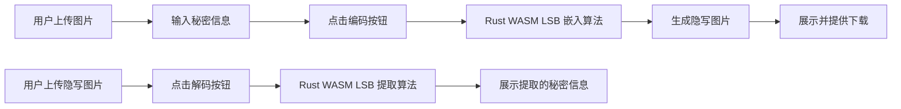

## 1. 产品概述

基于 WebAssembly 的 LSB 图像隐写工具，允许用户在图片中隐藏秘密信息并进行提取。核心像素处理通过 Rust 编译为 WASM 在浏览器端执行，提供高性能和安全性。

- 主要用途：安全隐写、数据隐藏、信息加密传输
- 目标用户：安全研究人员、隐私保护用户、开发者
- 产品价值：利用 WASM 高性能特性，在前端执行敏感操作，保护用户隐私

## 2. 核心功能

### 2.1 用户角色

| 角色 | 注册方式 | 核心权限 |
|------|----------|----------|
| 普通用户 | 无需注册 | 上传图片、编码隐藏信息、解码提取信息、下载结果 |

### 2.2 功能模块

1. **主页**：图片上传区域、秘密信息输入框、编码/解码操作区、结果展示区
2. **图片预览**：原始图片预览、隐写后图片预览
3. **文件管理**：图片上传暂存、结果图片下载

### 2.3 页面详情

| 页面名称 | 模块名称 | 功能描述 |
|---------|----------|----------|
| 主页 | 图片上传区 | 拖拽/点击上传图片，支持 PNG、BMP 等无损格式，实时预览 |
| 主页 | 秘密信息输入 | 文本输入框，支持多行输入，字符计数显示 |
| 主页 | 操作按钮区 | 编码按钮、解码按钮，带加载状态 |
| 主页 | 结果展示区 | 隐写图片预览、下载链接、提取的秘密信息展示 |

## 3. 核心流程

**编码流程**：
用户上传图片 → 输入秘密文本 → 点击编码 → Rust WASM 执行 LSB 算法嵌入信息 → 展示结果图片 → 用户下载

**解码流程**：
用户上传隐写图片 → 点击解码 → Rust WASM 执行 LSB 算法提取信息 → 展示提取的秘密文本

## 4. 用户界面设计

### 4.1 设计风格

- **主色调**：深色科技风格，深紫蓝 (#1a1a2e) 背景，霓虹青色 (#00d9ff) 强调
- **辅助色**：紫色渐变 (#667eea → #764ba2)、琥珀色 (#f59e0b) 警告
- **按钮风格**：圆角 8px，渐变背景，悬停发光效果
- **字体**：主字体使用 'JetBrains Mono' 等宽字体，科技感强
- **布局风格**：卡片式布局，玻璃拟态效果，微妙的网格背景
- **图标风格**：简约线性图标，使用 emoji 增强视觉吸引力

### 4.2 页面设计概述

| 页面名称 | 模块名称 | UI 元素 |
|---------|----------|---------|
| 主页 | 上传区域 | 虚线边框拖拽区，文件图标，悬停动画效果 |
| 主页 | 输入区域 | 深色文本域，字符计数器，最大长度提示 |
| 主页 | 操作按钮 | 渐变按钮，加载动画，禁用状态样式 |
| 主页 | 结果区域 | 图片预览卡片，复制按钮，下载按钮 |

### 4.3 响应式

- 桌面端优先设计，双列布局（上传区 + 结果区）
- 移动端自适应为单列布局
- 触摸友好的按钮尺寸（最小 48px）

### 4.4 视觉效果

- 背景：深色渐变 + 微妙的网格纹理
- 卡片：玻璃拟态效果，半透明背景，模糊效果
- 动画：按钮悬停发光、图片淡入、加载旋转动画
