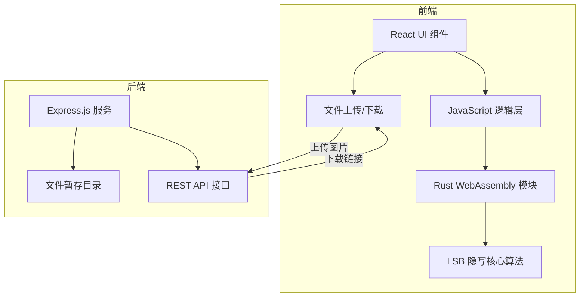

## 1. 架构设计



## 2. 技术描述

- **前端**：React@18 + Vite@5 + TailwindCSS@3
- **WebAssembly**：Rust + wasm-bindgen + wasm-pack
- **后端**：Node.js + Express@4
- **构建工具**：npm scripts、wasm-pack

## 3. 项目结构

```
j42/
├── frontend/              # 前端 React 应用
│   ├── src/
│   │   ├── components/    # React 组件
│   │   ├── wasm/          # WASM 模块包装
│   │   └── App.jsx
│   ├── public/
│   └── package.json
├── wasm/                  # Rust WASM 模块
│   ├── src/
│   │   └── lib.rs         # LSB 算法实现
│   ├── Cargo.toml
│   └── pkg/               # 编译输出
├── backend/               # Node.js 后端
│   ├── server.js
│   ├── uploads/           # 图片暂存目录
│   └── package.json
└── README.md
```

## 4. 路由定义

| 路由 | 方法 | 用途 |
|------|------|------|
| /api/upload | POST | 上传图片到服务器暂存 |
| /api/download/:filename | GET | 下载暂存的图片文件 |
| /api/list | GET | 获取已上传文件列表 |

## 5. API 定义

### 5.1 上传图片

**请求**：
```typescript
// multipart/form-data
{
  image: File;
}
```

**响应**：
```typescript
{
  success: boolean;
  filename: string;
  url: string;
}
```

### 5.2 下载图片

**请求**：`GET /api/download/:filename`

**响应**：图片文件流

## 6. WASM 模块接口

```rust
// 编码：将秘密信息嵌入图片像素
pub fn encode_image(pixels: &mut [u8], width: u32, height: u32, message: &str) -> Result<(), String>

// 解码：从图片像素中提取秘密信息
pub fn decode_image(pixels: &[u8], width: u32, height: u32) -> Result<String, String>
```

## 7. LSB 算法原理

1. **编码**：将每个字符的 8 位二进制数据，逐位嵌入到像素 RGB 通道的最低有效位
2. **解码**：从像素 RGB 通道的最低有效位中，逐位提取并重组为原始字符
3. **长度编码**：在前 32 位（4 字节）存储消息长度，便于解码时确定结束位置

## 8. 核心技术点

1. **WebAssembly 集成**：使用 wasm-bindgen 实现 JS 与 Rust 互操作
2. **Canvas 像素操作**：通过 HTML5 Canvas API 获取和设置图片像素数据
3. **文件处理**：后端使用 multer 中间件处理文件上传
4. **跨域配置**：后端配置 CORS 支持前后端分离部署
