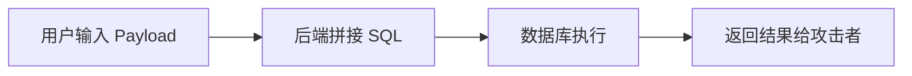
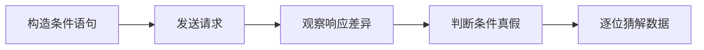

## 1. 产品概述

SQL 注入漏洞靶场 Web 应用，用于安全学习和培训。包含故意设计的 SQL 注入漏洞，帮助学习者理解和练习 SQL 注入攻击技术。

- 主要目的：提供安全学习环境，让学习者练习识别和利用 SQL 注入漏洞
- 目标用户：网络安全学习者、渗透测试人员、开发人员
- 产品价值：在安全可控的环境中学习 Web 安全漏洞利用技术

## 2. 核心功能

### 2.1 用户角色

| 角色 | 注册方式 | 核心权限 |
|------|----------|----------|
| 普通用户 | 登录验证 | 浏览商品、搜索商品 |
| 管理员 | 后台登录 | 管理后台、查看所有数据 |

### 2.2 功能模块

1. **登录页**：用户名密码登录，存在字符型 SQL 注入漏洞
2. **商品搜索页**：商品列表和搜索功能，存在数字型盲注漏洞
3. **后台管理页**：需要登录才能访问，展示用户和商品管理界面
4. **攻击控制台**：实时显示当前尝试的 Payload 和服务器响应时间

### 2.3 页面详情

| 页面名称 | 模块名称 | 功能描述 |
|----------|----------|----------|
| 登录页 | 登录表单 | 用户名/密码输入、登录按钮、注入点提示 |
| 登录页 | 攻击控制台 | Payload 显示、响应时间显示、历史记录 |
| 商品搜索页 | 搜索表单 | 分类 ID 搜索、商品列表展示 |
| 商品搜索页 | 攻击控制台 | Payload 显示、响应时间显示、盲注辅助 |
| 后台管理页 | 仪表盘 | 用户统计、商品统计、数据表格 |

## 3. 核心流程

### 3.1 字符型 SQL 注入流程

用户在登录页输入恶意 Payload → 后端直接拼接 SQL → 数据库执行恶意语句 → 返回登录成功或错误信息

### 3.2 数字型盲注流程

用户在搜索页输入带条件的 ID → 后端拼接 SQL → 根据页面响应判断条件真假 → 逐位猜解数据

## 4. 用户界面设计

### 4.1 设计风格

- **主色调**：深色科技风格，使用深蓝 (#0a1628) 作为主背景
- **强调色**：警告红 (#e63946) 用于漏洞提示，成功绿 (#2a9d8f) 用于成功提示
- **按钮风格**：圆角边框、悬停发光效果、赛博朋克风格
- **字体**：使用 JetBrains Mono 等宽字体展示代码和 Payload
- **布局风格**：左右分栏布局，左侧功能区，右侧攻击控制台
- **图标风格**：使用 Lucide 线性图标，配合黑客/安全主题

### 4.2 页面设计概述

| 页面名称 | 模块名称 | UI 元素 |
|----------|----------|---------|
| 登录页 | 登录表单 | 暗色卡片、发光输入框、霓虹边框按钮 |
| 登录页 | 攻击控制台 | 代码高亮 Payload 展示、毫秒级响应计时器、历史记录列表 |
| 商品搜索页 | 搜索区域 | 数字输入框、搜索按钮、商品卡片网格 |
| 商品搜索页 | 攻击控制台 | 盲注辅助工具、真假状态指示器、响应时间图表 |
| 后台管理页 | 仪表盘 | 统计卡片、数据表格、侧边导航 |

### 4.3 响应式设计

- 桌面端：左右分栏布局，攻击控制台固定在右侧
- 平板端：上下布局，控制台在功能区下方
- 移动端：单栏滚动布局，控制台可折叠

### 4.4 动效设计

- 页面加载：渐变透明度动画，元素依次淡入
- 输入框：聚焦时边框发光效果
- 按钮：悬停时缩放和发光效果
- 控制台：新 Payload 到来时高亮闪烁动画
- 响应时间：数字滚动动画效果
