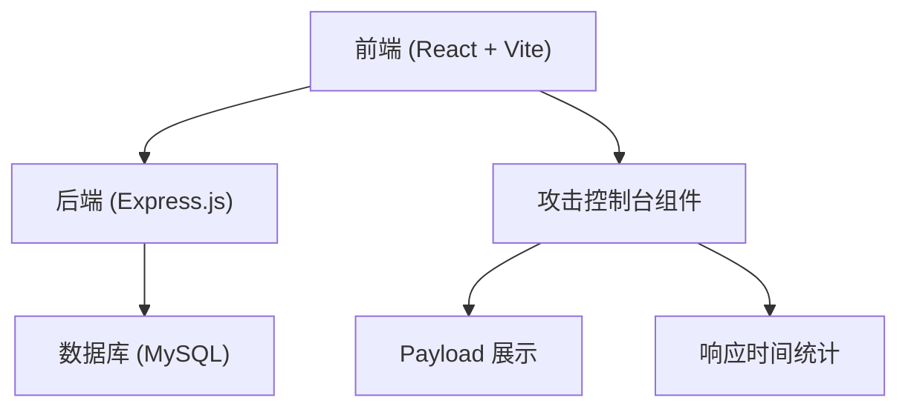
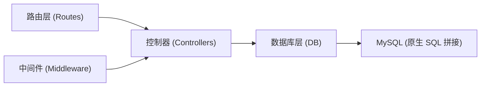
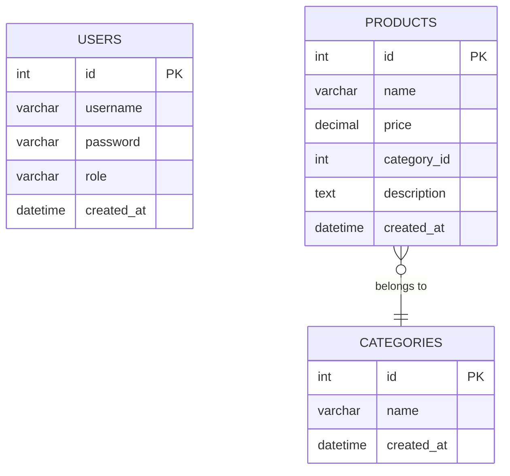

## 1. 架构设计



## 2. 技术栈说明

### 2.1 前端技术栈
- **框架**: React 18 + TypeScript
- **构建工具**: Vite
- **样式**: Tailwind CSS 3
- **路由**: React Router DOM
- **状态管理**: Zustand
- **图标**: Lucide React
- **代码高亮**: Prism.js

### 2.2 后端技术栈
- **框架**: Express.js 4
- **数据库驱动**: mysql2 (原生 SQL 拼接)
- **认证**: Session + Cookie
- **CORS**: 跨域支持

### 2.3 数据库
- **MySQL 8.0+**
- 故意不使用参数化查询，直接字符串拼接 SQL

## 3. 路由定义

| 路由 | 页面/接口 | 用途 |
|------|----------|------|
| / | 登录页 | 用户登录入口，字符型 SQL 注入点 |
| /search | 商品搜索页 | 商品搜索，数字型盲注点 |
| /admin | 后台管理页 | 需要登录认证 |
| POST /api/login | 登录接口 | 存在字符型 SQL 注入 |
| GET /api/products | 商品搜索接口 | 存在数字型盲注 |
| GET /api/admin/stats | 后台统计接口 | 需要登录 |

## 4. API 定义

### 4.1 登录接口 (存在 SQL 注入)

```typescript
// 请求
interface LoginRequest {
  username: string;
  password: string;
}

// 响应
interface LoginResponse {
  success: boolean;
  message: string;
  user?: {
    id: number;
    username: string;
    role: string;
  };
  executionTime: number;
  executedSql: string;
}
```

**漏洞实现**:
```typescript
// 故意的漏洞代码 - 直接拼接 SQL
const sql = `SELECT * FROM users WHERE username = '${username}' AND password = '${password}'`;
```

### 4.2 商品搜索接口 (存在盲注)

```typescript
// 请求
interface SearchRequest {
  categoryId: string;
}

// 响应
interface SearchResponse {
  products: Product[];
  executionTime: number;
  executedSql: string;
}
```

**漏洞实现**:
```typescript
// 故意的漏洞代码 - 数字型注入
const sql = `SELECT * FROM products WHERE category_id = ${categoryId}`;
```

## 5. 服务器架构



## 6. 数据模型

### 6.1 ER 图



### 6.2 DDL 语句

```sql
CREATE DATABASE IF NOT EXISTS sqlilab;
USE sqlilab;

CREATE TABLE users (
  id INT AUTO_INCREMENT PRIMARY KEY,
  username VARCHAR(50) NOT NULL UNIQUE,
  password VARCHAR(50) NOT NULL,
  role VARCHAR(20) DEFAULT 'user',
  created_at DATETIME DEFAULT CURRENT_TIMESTAMP
);

CREATE TABLE categories (
  id INT AUTO_INCREMENT PRIMARY KEY,
  name VARCHAR(50) NOT NULL,
  created_at DATETIME DEFAULT CURRENT_TIMESTAMP
);

CREATE TABLE products (
  id INT AUTO_INCREMENT PRIMARY KEY,
  name VARCHAR(100) NOT NULL,
  price DECIMAL(10, 2) NOT NULL,
  category_id INT NOT NULL,
  description TEXT,
  created_at DATETIME DEFAULT CURRENT_TIMESTAMP,
  FOREIGN KEY (category_id) REFERENCES categories(id)
);

-- 初始化数据
INSERT INTO users (username, password, role) VALUES 
('admin', 'admin123', 'admin'),
('user1', 'pass123', 'user'),
('test', 'test123', 'user');

INSERT INTO categories (name) VALUES 
('电子产品'),
('图书'),
('服装'),
('食品');

INSERT INTO products (name, price, category_id, description) VALUES 
('iPhone 15', 6999.00, 1, '最新款智能手机'),
('MacBook Pro', 12999.00, 1, '高性能笔记本电脑'),
('Web安全深度剖析', 89.00, 2, '网络安全学习书籍'),
('SQL注入攻击与防御', 68.00, 2, 'SQL注入技术详解'),
('黑客T恤', 99.00, 3, '极客风格T恤'),
('能量饮料', 8.00, 4, '提神醒脑饮品');
```
