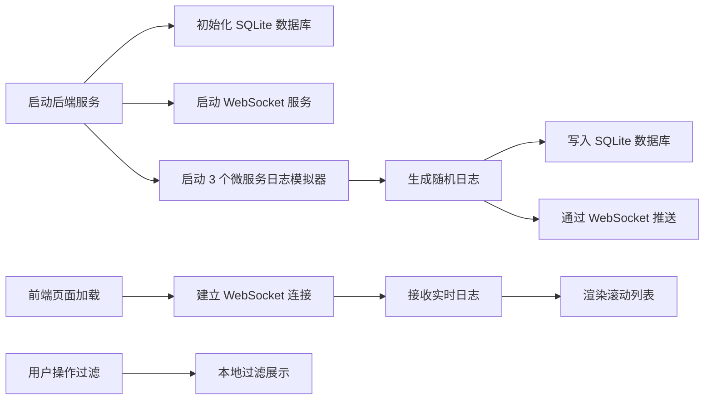

## 1. 产品概述

分布式日志收集与展示平台，用于实时收集和展示微服务架构下多服务的日志数据。平台通过 WebSocket 实现实时日志推送，将日志持久化到 SQLite 数据库，并提供多维度过滤功能。

- 主要目的：解决分布式系统中日志分散、难以实时监控和排查问题的痛点
- 目标用户：开发人员、运维工程师、技术支持人员
- 产品价值：提供统一的日志视图，实现实时监控、快速定位问题、历史日志回溯

## 2. 核心功能

### 2.1 用户角色

| 角色 | 注册方式 | 核心权限 |
|------|----------|----------|
| 开发者 | 无需注册，直接访问 | 查看实时日志、过滤日志、浏览历史日志 |

### 2.2 功能模块

1. **实时日志看板**：WebSocket 实时接收日志流，滚动列表展示
2. **日志过滤**：按服务名称过滤、按日志级别过滤
3. **日志存储**：后端自动将所有日志写入 SQLite 数据库
4. **模拟日志生成**：后端模拟 3 个虚拟微服务持续产生不同级别的日志

### 2.3 页面详情

| 页面名称 | 模块名称 | 功能描述 |
|-----------|-------------|---------------------|
| 日志看板 | 顶部状态栏 | 显示连接状态、日志总数、各服务日志计数 |
| 日志看板 | 过滤栏 | 服务名下拉选择、日志级别复选框过滤 |
| 日志看板 | 日志列表 | 无限滚动日志列表，按时间倒序展示，支持自动滚动 |
| 日志看板 | 日志项 | 展示时间戳、服务名标签、日志级别标签、原始消息 |

## 3. 核心流程

后端启动后，初始化 SQLite 数据库并创建日志表，同时启动 WebSocket 服务和 3 个微服务的日志模拟器。前端页面加载后，建立 WebSocket 连接，开始接收实时日志并展示。用户可通过过滤条件筛选感兴趣的日志。

## 4. 用户界面设计

### 4.1 设计风格

- 主色调：深色背景 (#0f172a)，适合长时间监控使用
- 辅助色：
  - INFO: #3b82f6 (蓝色)
  - WARN: #f59e0b (橙色)
  - ERROR: #ef4444 (红色)
  - DEBUG: #8b5cf6 (紫色)
- 按钮风格：扁平化，圆角 6px，hover 状态轻微高亮
- 字体：JetBrains Mono 等宽字体用于日志内容，Inter 用于界面文字
- 布局风格：卡片式布局，顶部固定过滤栏，下方可滚动日志区域
- 图标风格：lucide-react 线性图标

### 4.2 页面设计概述

| 页面名称 | 模块名称 | UI 元素 |
|-----------|-------------|-------------|
| 日志看板 | 顶部状态栏 | 连接状态指示灯、统计数字卡片、网格布局 |
| 日志看板 | 过滤栏 | 下拉选择框、复选框组、重置按钮、卡片容器 |
| 日志看板 | 日志列表 | 固定高度容器、内部滚动、项间分隔线、悬停高亮 |
| 日志看板 | 日志项 | 时间戳（小字灰色）、服务名标签（圆角胶囊）、级别标签（彩色背景）、消息内容（等宽字体） |

### 4.3 响应性

- 桌面端优先设计，适配 1280px 及以上宽度
- 过滤栏在小屏幕上垂直堆叠
- 日志列表自适应容器高度
- 触摸设备优化滚动体验

### 4.4 动效设计

- 新日志进入时从上方滑入（轻微 translate + fade）
- 过滤条件变化时列表平滑过渡
- 连接状态变化时有呼吸灯效果
- 悬停日志项时背景色轻微变化
