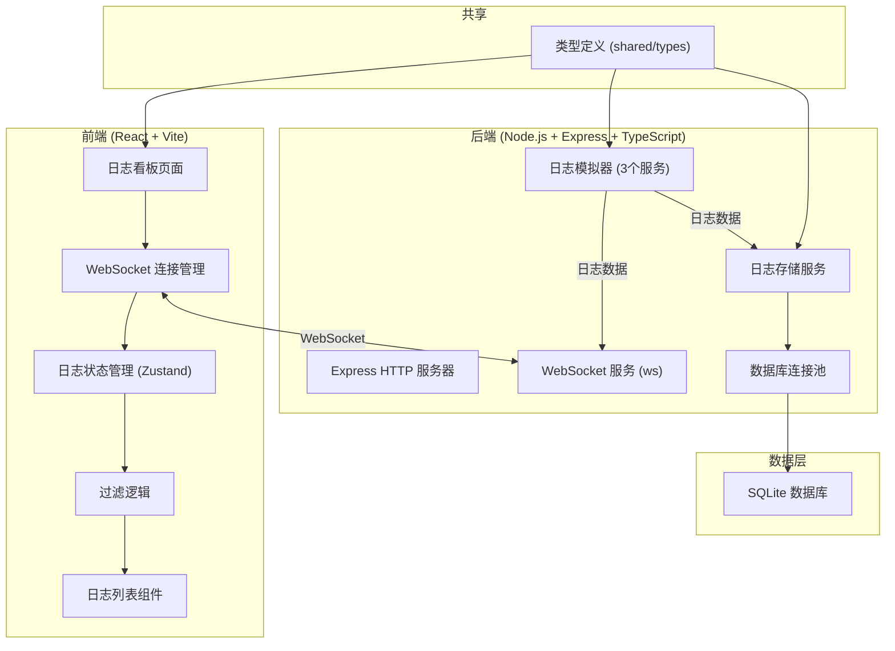
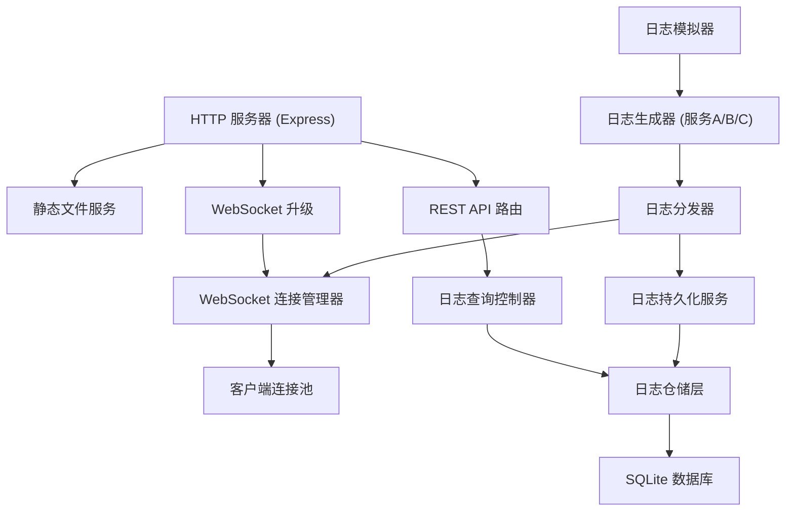
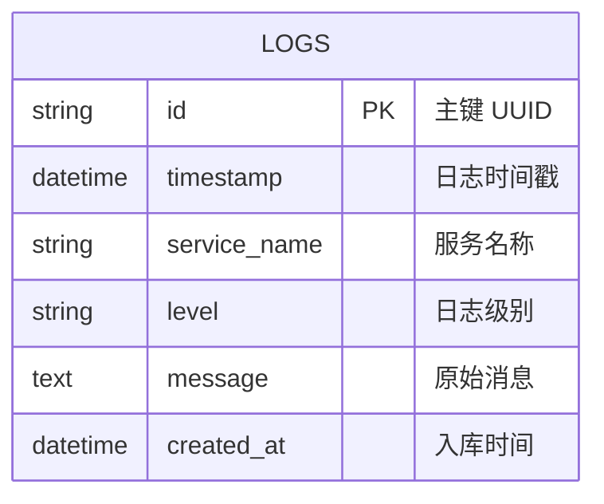

## 1. 架构设计



## 2. 技术描述

- 前端：React@18 + TypeScript + Vite + TailwindCSS@3 + Zustand + lucide-react
- 后端：Express@4 + TypeScript + ws (WebSocket) + better-sqlite3
- 数据库：SQLite (better-sqlite3)
- 构建工具：Vite
- 包管理器：npm

## 3. 路由定义

| 路由 | 用途 |
|-------|---------|
| / | 日志看板主页 |
| /ws | WebSocket 连接端点 |
| /api/logs | HTTP 获取历史日志 (REST API) |

## 4. API 定义

### 4.1 WebSocket 消息协议

```typescript
// 共享类型定义 shared/types.ts
export type LogLevel = 'DEBUG' | 'INFO' | 'WARN' | 'ERROR';

export interface LogEntry {
  id: string;
  timestamp: number;
  serviceName: string;
  level: LogLevel;
  message: string;
}

export interface WebSocketMessage {
  type: 'log' | 'history' | 'status';
  data: LogEntry | LogEntry[] | { connected: boolean; count: number };
}
```

### 4.2 HTTP API

```typescript
// GET /api/logs
interface GetLogsRequest {
  serviceName?: string;
  level?: LogLevel;
  limit?: number;
  offset?: number;
}

interface GetLogsResponse {
  logs: LogEntry[];
  total: number;
}
```

## 5. 服务器架构图



## 6. 数据模型

### 6.1 数据模型定义



### 6.2 数据定义语言

```sql
-- migrations/001_init.sql
CREATE TABLE IF NOT EXISTS logs (
  id TEXT PRIMARY KEY,
  timestamp INTEGER NOT NULL,
  service_name TEXT NOT NULL,
  level TEXT NOT NULL CHECK (level IN ('DEBUG', 'INFO', 'WARN', 'ERROR')),
  message TEXT NOT NULL,
  created_at INTEGER DEFAULT (strftime('%s', 'now'))
);

CREATE INDEX IF NOT EXISTS idx_logs_service_name ON logs(service_name);
CREATE INDEX IF NOT EXISTS idx_logs_level ON logs(level);
CREATE INDEX IF NOT EXISTS idx_logs_timestamp ON logs(timestamp DESC);

-- 初始化完成标记
INSERT INTO schema_migrations (version, name) VALUES ('001', 'init');
```

### 6.3 数据库初始化脚本

```typescript
// api/db/init.ts
import Database from 'better-sqlite3';
import fs from 'fs';
import path from 'path';

export function initDatabase(dbPath: string): Database.Database {
  const db = new Database(dbPath);
  
  // 执行迁移脚本
  const migrationsDir = path.join(__dirname, '../../migrations');
  const migrationFiles = fs.readdirSync(migrationsDir)
    .filter(f => f.endsWith('.sql'))
    .sort();
    
  for (const file of migrationFiles) {
    const sql = fs.readFileSync(path.join(migrationsDir, file), 'utf-8');
    db.exec(sql);
  }
  
  return db;
}
```
