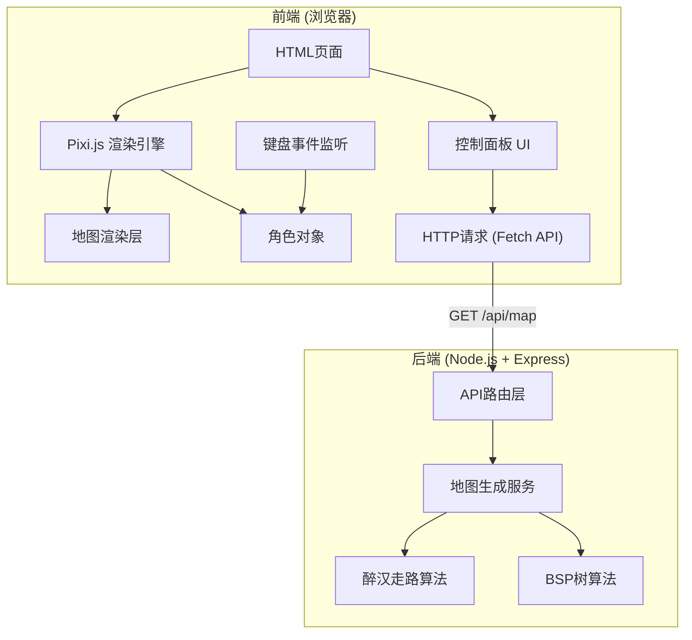

## 1. 架构设计



## 2. 技术描述
- **前端**：原生HTML/CSS/JavaScript + Pixi.js v7 + Vite
- **初始化工具**：Vite
- **后端**：Node.js + TypeScript + Express v4
- **开发语言**：TypeScript (前后端统一)
- **构建工具**：ts-node (后端开发)、tsc (编译)
- **地图数据**：二维数组，0=墙壁，1=地板，2=宝箱

## 3. 目录结构

```
j65/
├── client/                 # 前端代码
│   ├── index.html
│   ├── src/
│   │   ├── main.ts         # 入口文件
│   │   ├── game/
│   │   │   ├── Game.ts     # 游戏主类
│   │   │   ├── Player.ts   # 角色类
│   │   │   └── MapRenderer.ts  # 地图渲染器
│   │   └── types/
│   │       └── index.ts    # 类型定义
│   └── package.json
├── server/                 # 后端代码
│   ├── src/
│   │   ├── index.ts        # 服务器入口
│   │   ├── routes/
│   │   │   └── map.ts      # 地图API路由
│   │   ├── generators/
│   │   │   ├── DrunkardsWalk.ts  # 醉汉走路算法
│   │   │   └── BSPTree.ts       # BSP树算法
│   │   └── types/
│   │       └── index.ts    # 类型定义
│   └── package.json
├── shared/                 # 共享类型
│   └── types.ts
└── package.json            # 根package.json
```

## 4. 路由定义
| 路由 | 方法 | 用途 |
|------|------|------|
| /api/map | GET | 生成随机地图，支持query参数：algorithm, width, height |
| / | GET | 静态文件服务，返回前端页面 |

## 5. API定义

### 请求参数
```typescript
interface MapRequest {
  algorithm: 'drunkard' | 'bsp';
  width: number;       // 地图宽度 (30-100)
  height: number;      // 地图高度 (30-100)
  seed?: number;       // 可选随机种子
}
```

### 响应数据
```typescript
interface MapResponse {
  map: number[][];     // 二维数组：0=墙壁, 1=地板, 2=宝箱
  width: number;
  height: number;
  algorithm: string;
  startPosition: { x: number; y: number };
  chestCount: number;
}
```

## 6. 数据模型

### 地图格子类型
```typescript
enum TileType {
  WALL = 0,
  FLOOR = 1,
  CHEST = 2,
}
```

### 角色状态
```typescript
interface PlayerState {
  x: number;
  y: number;
  chestsCollected: number;
}
```

### BSP树节点
```typescript
interface BSPNode {
  x: number;
  y: number;
  width: number;
  height: number;
  left?: BSPNode;
  right?: BSPNode;
  room?: Room;
}

interface Room {
  x: number;
  y: number;
  width: number;
  height: number;
}
```

## 7. 核心算法说明

### 7.1 醉汉走路算法
1. 初始化全墙壁地图
2. 随机选择起点，标记为地板
3. 随机上下左右移动，标记经过的位置为地板
4. 当地板数量达到总格子的40%时停止
5. 在随机地板位置放置宝箱

### 7.2 BSP树算法
1. 创建根节点覆盖整个地图
2. 递归分割节点，直到节点小于最小尺寸
3. 在每个叶子节点内创建房间
4. 连接相邻房间创建走廊
5. 在随机房间内放置宝箱

## 8. 前端交互流程

1. 页面加载时自动请求默认地图
2. Pixi.js初始化画布，创建地图渲染层
3. 接收地图数据，根据二维数组渲染不同颜色的方块
4. 在起点位置创建角色精灵
5. 监听键盘WASD事件，更新角色位置
6. 移动前检测目标格子是否为地板，是则允许移动
7. 如果目标格子是宝箱，增加计数并将格子改为地板
8. 更新UI状态显示
