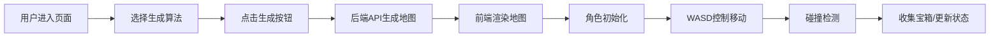

## 1. 产品概述
基于Web的Roguelike地牢生成器，用户可以生成随机地牢地图并控制角色在其中探索。
- 主要目的：提供一个可视化的随机地牢生成和探索体验
- 目标用户：游戏开发者、Roguelike游戏爱好者、算法学习者

## 2. 核心功能

### 2.1 用户角色
| 角色 | 注册方式 | 核心权限 |
|------|----------|----------|
| 普通用户 | 无需注册 | 生成地图、控制角色移动、切换算法 |

### 2.2 功能模块
1. **主页面**：地图渲染区域、控制面板、角色状态栏
2. **地图生成模块**：支持醉汉走路和BSP树两种算法
3. **角色控制模块**：WASD键盘移动、碰撞检测

### 2.3 页面详情
| 页面名称 | 模块名称 | 功能描述 |
|----------|----------|----------|
| 主页面 | 地图渲染区 | 使用Pixi.js渲染二维地图，不同颜色区分墙壁、地板、宝箱 |
| 主页面 | 控制面板 | 选择算法、设置地图尺寸、重新生成地图按钮 |
| 主页面 | 角色状态栏 | 显示当前位置、收集的宝箱数量 |

## 3. 核心流程
用户进入页面 → 选择地图生成算法 → 点击生成按钮 → 后端生成二维数组地图 → 前端渲染地图 → 角色出现在起点 → 用户使用WASD控制角色移动 → 角色与地图碰撞检测 → 收集宝箱更新状态

## 4. 用户界面设计

### 4.1 设计风格
- **主色调**：深紫色 (#1a0a2e) 作为背景，营造地牢氛围
- **辅助色**：金黄色 (#ffd700) 用于宝箱和高亮，青绿色 (#00ff88) 用于角色
- **墙壁**：深灰色 (#2d2d44)，**地板**：中灰色 (#4a4a6a)
- **字体**：使用Press Start 2P等像素风格字体，营造复古游戏感
- **布局**：左侧为游戏画布，右侧为控制面板，采用卡片式设计
- **像素风格**：所有元素采用像素化渲染，方块化地图格子

### 4.2 页面设计概述
| 页面名称 | 模块名称 | UI元素 |
|----------|----------|--------|
| 主页面 | 地图渲染区 | 800x600像素画布，网格状地图，像素风格渲染 |
| 主页面 | 控制面板 | 下拉选择框、数字输入框、按钮、状态信息卡片 |
| 主页面 | 状态栏 | 位置坐标显示、宝箱计数、算法信息 |

### 4.3 响应性
- 桌面端优先设计，游戏画布固定尺寸
- 控制面板自适应宽度，在小屏幕上转为上下布局
- 键盘操作仅支持桌面端

### 4.4 视觉效果
- 地图生成时添加淡入动画
- 角色移动时添加平滑过渡效果
- 宝箱收集时添加闪烁特效
- 悬停按钮时添加像素风格的高亮边框
