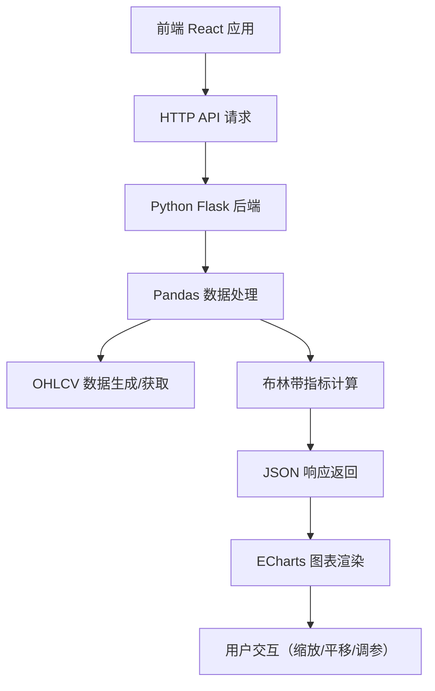
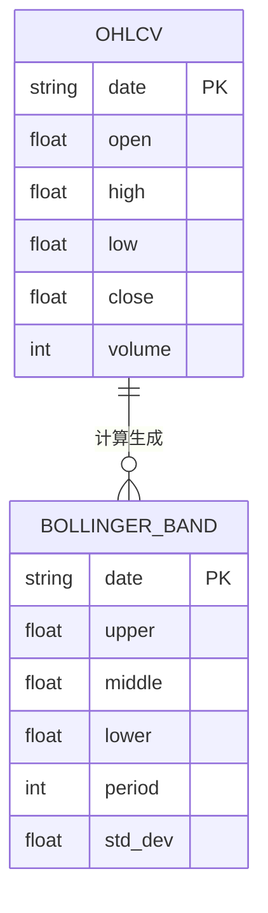

## 1. 架构设计



## 2. 技术描述

- **前端**：React@18 + Vite@5 + TypeScript + ECharts@5
- **初始化工具**：Vite
- **样式方案**：TailwindCSS@3
- **后端**：Python 3.10 + Flask@3
- **数据处理**：Pandas@2 + NumPy@1
- **数据来源**：模拟生成 OHLCV 数据，支持后续扩展接入真实数据源

## 3. 目录结构

```
j67/
├── backend/
│   ├── app.py              # Flask 应用主入口
│   ├── stock_data.py       # 股票数据生成模块
│   ├── bollinger_bands.py  # 布林带计算模块
│   └── requirements.txt    # Python 依赖
├── frontend/
│   ├── src/
│   │   ├── components/
│   │   │   ├── StockChart.tsx      # K线图+布林带组件
│   │   │   ├── ControlPanel.tsx    # 参数控制面板
│   │   │   └── Header.tsx          # 顶部导航
│   │   ├── services/
│   │   │   └── api.ts              # API 请求封装
│   │   ├── types/
│   │   │   └── stock.ts            # 类型定义
│   │   ├── App.tsx
│   │   ├── main.tsx
│   │   └── index.css
│   ├── package.json
│   ├── vite.config.ts
│   └── tsconfig.json
└── README.md
```

## 4. 路由定义

| 路由 | 用途 |
|-------|------|
| / | 主页面，展示股票图表和控制面板 |
| /api/stock | 获取股票 OHLCV 数据 |
| /api/bollinger | 计算并返回布林带数据 |

## 5. API 定义

### 5.1 获取股票数据

**GET** `/api/stock`

请求参数：
```typescript
interface StockRequest {
  symbol: string;      // 股票代码
  startDate: string;   // 开始日期 YYYY-MM-DD
  endDate: string;     // 结束日期 YYYY-MM-DD
}
```

响应格式：
```typescript
interface OHLCVData {
  date: string;
  open: number;
  high: number;
  low: number;
  close: number;
  volume: number;
}

interface StockResponse {
  symbol: string;
  data: OHLCVData[];
}
```

### 5.2 计算布林带

**POST** `/api/bollinger`

请求参数：
```typescript
interface BollingerRequest {
  data: OHLCVData[];
  period: number;      // 周期，默认 20
  stdDev: number;      // 标准差倍数，默认 2
}
```

响应格式：
```typescript
interface BollingerBand {
  date: string;
  upper: number;       // 上轨
  middle: number;      // 中轨（均线）
  lower: number;       // 下轨
}

interface BollingerResponse {
  bands: BollingerBand[];
  period: number;
  stdDev: number;
}
```

## 6. 数据模型

### 6.1 OHLCV 数据模型



### 6.2 布林带计算逻辑

1. 中轨 = N 日简单移动平均线 (SMA)
2. 上轨 = 中轨 + K × N 日标准差
3. 下轨 = 中轨 - K × N 日标准差

其中：
- N = 周期（默认 20）
- K = 标准差倍数（默认 2）

## 7. 前端核心组件

### StockChart 组件
- 使用 ECharts 绘制 K 线图（candlestick）
- 叠加三条折线图表示布林带上、中、下轨
- 下方柱状图展示成交量
- 配置 dataZoom 支持鼠标滚轮缩放和拖拽平移
- 配置 tooltip 显示详细数据

### ControlPanel 组件
- 股票代码选择器
- 布林带周期滑块（5-50）
- 标准差倍数输入（1-3）
- 重新计算按钮

### 交互实现
- ECharts `dataZoom` 组件内置支持鼠标滚轮缩放和拖拽
- `type: 'inside'` 支持内置数据区域缩放
- `type: 'slider'` 支持底部滑动条缩放
