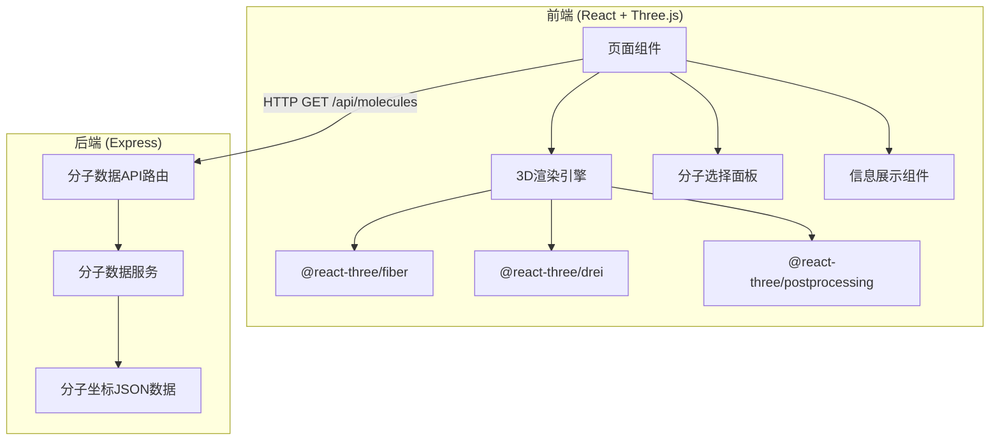

## 1. 架构设计



## 2. 技术说明

- 前端：React@18 + TypeScript + Tailwind CSS + Vite
- 3D渲染：three + @react-three/fiber + @react-three/drei + @react-three/postprocessing
- 状态管理：zustand
- 初始化工具：vite-init (react-express-ts 模板)
- 后端：Express@4 + TypeScript
- 数据库：无，使用静态 JSON 数据

## 3. 路由定义

| 路由 | 用途 |
|------|------|
| / | 主页面，3D 分子查看器 |

## 4. API 定义

### 4.1 获取分子列表

```
GET /api/molecules
Response: {
  molecules: Array<{
    id: string;
    name: string;
    formula: string;
    molecularWeight: number;
    atomCount: number;
  }>
}
```

### 4.2 获取分子详情

```
GET /api/molecules/:id
Response: {
  id: string;
  name: string;
  formula: string;
  molecularWeight: number;
  atoms: Array<{
    element: string;
    x: number;
    y: number;
    z: number;
  }>;
  bonds: Array<{
    from: number;
    to: number;
    order: number;
  }>
}
```

### 4.3 TypeScript 类型定义

```typescript
interface Atom {
  element: string;
  x: number;
  y: number;
  z: number;
}

interface Bond {
  from: number;
  to: number;
  order: number;
}

interface MoleculeSummary {
  id: string;
  name: string;
  formula: string;
  molecularWeight: number;
  atomCount: number;
}

interface MoleculeDetail extends MoleculeSummary {
  atoms: Atom[];
  bonds: Bond[];
}
```

## 5. 服务器架构图

```mermaid
graph LR
    "Controller[路由控制器]" --> "Service[分子数据服务]"
    "Service" --> "Data[静态JSON数据]"
```

## 6. 数据模型

采用静态 JSON 数据，无需数据库。

### 分子数据结构

- **水 (H₂O)**：3个原子，2条键
- **乙醇 (C₂H₅OH)**：9个原子，8条键
- **苯 (C₆H₆)**：12个原子，12条键
- **甲烷 (CH₄)**：5个原子，4条键
- **二氧化碳 (CO₂)**：3个原子，2条键
- **氨 (NH₃)**：4个原子，3条键

### CPK 原子配色及半径

| 元素 | 颜色 | 半径(Angstrom) |
|------|------|----------------|
| H | #FFFFFF | 0.31 |
| C | #404040 | 0.77 |
| O | #FF0000 | 0.73 |
| N | #3050F8 | 0.75 |
