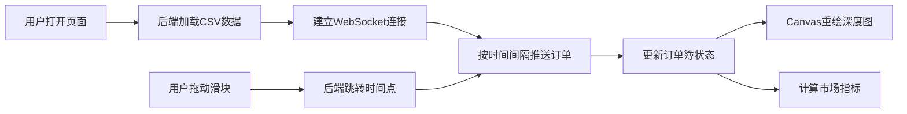

## 1. 产品概述

订单簿回放可视化系统，用于预先生成的金融订单簿数据的实时回放与可视化展示。系统通过WebSocket按实际时间流速推送订单事件，前端使用Canvas动态渲染买卖深度图，并实时计算展示关键市场指标。

- 核心价值：为量化交易者、市场研究人员提供直观的订单簿动态可视化工具，帮助理解市场微观结构变化
- 目标用户：量化交易员、金融研究人员、算法交易开发者

## 2. 核心 Features

### 2.1 用户角色

| 角色 | 核心权限 |
|------|----------|
| 普通用户 | 观看回放、调整时间点、查看实时指标 |

### 2.2 功能模块

1. **数据回放模块**：从CSV读取100万条订单簿事件，按timestamp时间间隔回放
2. **WebSocket通信模块**：实时推送订单事件到前端
3. **深度图绘制模块**：Canvas动态渲染买/卖深度曲线
4. **指标计算模块**：实时计算买卖价差、订单不平衡指标
5. **时间控制模块**：滑块拖动跳转任意时间点

### 2.3 页面详情

| 页面名称 | 模块名称 | 功能描述 |
|-----------|-------------|---------------------|
| 主页面 | 深度图区域 | Canvas绘制买卖双边累计量-价格曲线，买盘绿色、卖盘红色 |
| 主页面 | 指标面板 | 显示当前买一价、卖一价、买卖价差、订单不平衡率 |
| 主页面 | 控制面板 | 播放/暂停按钮、时间进度滑块、当前时间显示 |
| 主页面 | 状态指示 | WebSocket连接状态、数据加载进度 |

## 3. 核心流程

用户打开页面 → 后端加载CSV数据 → 建立WebSocket连接 → 后端按时间间隔推送订单事件 → 前端更新订单簿状态 → Canvas重绘深度图 → 计算并更新指标 → 用户拖动滑块 → 后端跳转至指定时间点 → 继续回放

## 4. 用户界面设计

### 4.1 设计风格

- 主题：深色金融终端风格，专业、高精度
- 主色调：深灰背景 (#0d1117，买盘绿色 (#00d26a)，卖盘红色 (#ff4757)
- 字体：JetBrains Mono 等宽字体，专业代码风格
- 布局：上下结构，深度图占主要区域，指标面板悬浮右上角，控制面板在底部
- 细节：细腻的网格线、渐变填充、发光效果

### 4.2 页面设计概览

| 页面名称 | 模块名称 | UI 元素 |
|-----------|-------------|-------------|
| 主页面 | 深度图区域 | 黑色背景、网格线、渐变填充的深度曲线、价格轴、数量轴 |
| 主页面 | 指标面板 | 半透明深色卡片、等宽字体、数值实时跳动动画 |
| 主页面 | 控制面板 | 自定义滑块样式、播放按钮带发光效果 |
| 主页面 | 状态指示 | 连接状态指示灯、数据加载进度条 |

### 4.3 响应式

- 桌面端优先，深度图自适应容器自适应
- 控制面板固定底部铺满
- 指标面板固定右上角

