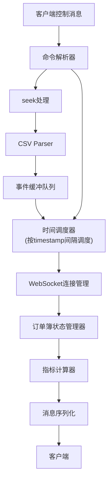

## 1. 架构设计

```mermaid
graph TD
    A["CSV数据文件\n(100万条订单事件)"] --> B["Node.js后端服务器"]
    B -->|"WebSocket\n(orderbook_events.csv"]
    B -->|"时间调度器
    C["时间调度器"] -->|按时间间隔推送
    D["WebSocket Server"] -->|实时推送订单事件| E["浏览器前端"]
    E --> F["Canvas深度图渲染器"]
    E --> G["指标计算器"]
    E --> H["时间控制器"]
    H -->|"seek时间点请求| D
```

## 2. 技术选型

- 后端：Node.js + ws (WebSocket库) + csv-parser
- 前端：原生 HTML5 + CSS3 + JavaScript (ES6+)
- 数据存储：CSV文件 (预先生成)
- 构建工具：无需构建工具，直接运行

## 3. 项目结构

```
orderbook-replay/
├── data/
│   └── orderbook_events.csv   # 100万条订单数据
├── server/
│   ├── generate-data.js        # 数据生成脚本
│   └── server.js          # WebSocket服务器
├── public/
│   ├── index.html          # 主页面
│   ├── css/
│   │   └── style.css       # 样式文件
│   └── js/
│       ├── orderbook.js    # 订单簿管理
│       ├── renderer.js   # Canvas渲染
│       ├── metrics.js    # 指标计算
│       └── app.js          # 主应用逻辑
└── package.json
```

## 4. API 定义

### WebSocket 消息协议

#### 服务端 → 客户端

**订单事件 (order_event)

```typescript
interface OrderEvent {
    type: 'order_event';
    timestamp: number;      // 事件时间戳 (ms)
    side: 'bid' | 'ask';
    price: number;
    quantity: number;
    sequence: number;    // 事件序列号
}
```

**订单簿快照 (orderbook_snapshot)

```typescript
interface OrderbookSnapshot {
    type: 'orderbook_snapshot';
    timestamp: number;
    bids: Array<[number, number]>;  // [price, quantity]
    asks: Array<[number, number]>;  // [price, quantity]
    bestBid: number;
    bestAsk: number;
    spread: number;
    imbalance: number;
}
```

**回放状态 (replay_status)

```typescript
interface ReplayStatus {
    type: 'replay_status';
    currentTime: number;
    totalEvents: number;
    processedEvents: number;
    isPlaying: boolean;
}
```

#### 客户端 → 服务端

**控制命令 (control)

```typescript
interface ControlMessage {
    action: 'play' | 'pause' | 'seek';
    timestamp?: number;  // seek时需要
    speed?: number;      // 播放速度倍率
}
```

## 5. 服务器架构



## 6. 数据模型

### 6.1 订单簿事件数据

| 字段 | 类型 | 说明 |
|------|------|------|
| timestamp | number | 事件时间戳 (毫秒) |
| side | string | 'bid' (买单 / 'ask' (卖单) |
| price | number | 价格 |
| quantity | number | 数量 |

### 6.2 CSV 文件格式

```csv
timestamp,side,price,quantity
1717209600000,bid,100.50,10
1717209600100,ask,100.55,5
...
```

### 6.3 订单簿状态

```typescript
interface OrderbookState {
    bids: Map<number, number>;  // price -> quantity
    asks: Map<number, number>;  // price -> quantity
    bestBid: number;
    bestAsk: number;
    lastUpdateTime: number;
}
```

## 7. 核心算法

### 7.1 订单不平衡指标 (Order Imbalance)

```
Imbalance = (BidVolume - AskVolume / (BidVolume + AskVolume)
```

其中 BidVolume 为买盘前 N 档累计量，AskVolume 为卖盘前 N 档累计量。

### 7.2 买卖价差 (Spread)

```
Spread = BestAsk - BestBid
```

### 7.3 累计量计算

按价格档位从最优向深档累计，用于绘制深度图曲线。

## 8. 性能优化

- 数据预加载：CSV数据一次性加载到内存，使用TypedArray存储
- 时间调度：使用优先级队列按时间戳排序
- Canvas渲染：requestAnimationFrame批量渲染，避免频繁重绘
- 增量更新：仅推送变化的档位，减少数据传输

