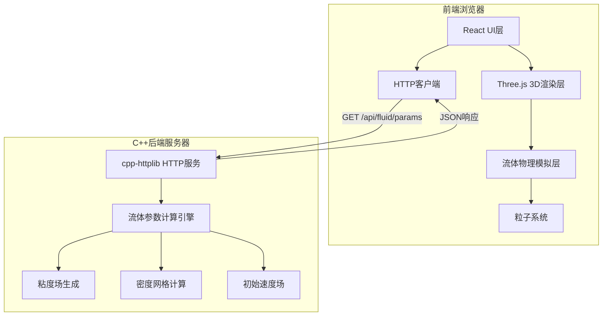
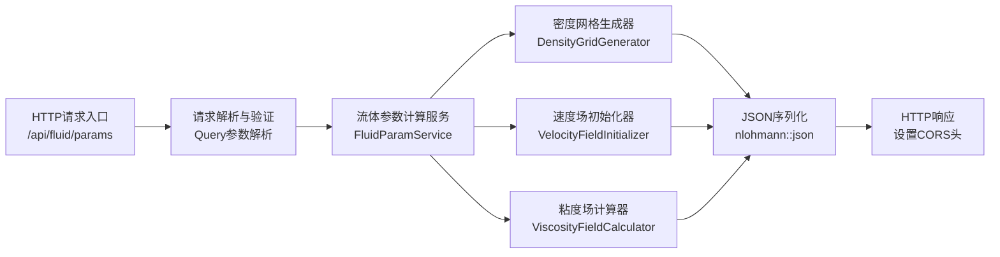
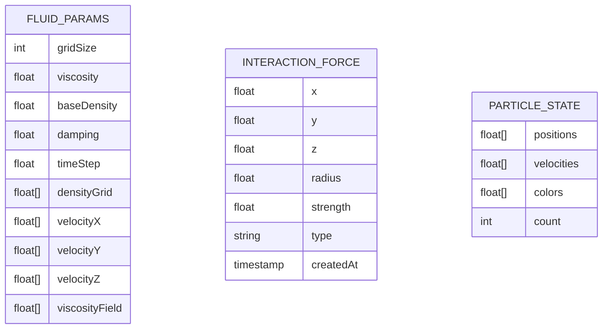

## 1. 架构设计



## 2. 技术描述

### 前端技术栈
- **框架**: React 18 + TypeScript
- **构建工具**: Vite 5
- **3D渲染**: Three.js + @react-three/fiber + @react-three/drei
- **后期处理**: @react-three/postprocessing
- **样式**: TailwindCSS 3
- **HTTP客户端**: Axios
- **状态管理**: React Hooks (useState, useRef, useFrame)

### 后端技术栈
- **语言**: C++17
- **HTTP框架**: cpp-httplib (单头文件HTTP库)
- **JSON库**: nlohmann/json (单头文件JSON库)
- **编译器**: MinGW-w64 (GCC) 或 MSVC
- **构建工具**: CMake

### 核心依赖
- `three`: ^0.160.0
- `@react-three/fiber`: ^8.15.0
- `@react-three/drei`: ^9.92.0
- `@react-three/postprocessing`: ^2.15.0
- `axios`: ^1.6.0
- `tailwindcss`: ^3.4.0

## 3. 路由定义

| 路由 | 组件 | 用途 |
|------|------|------|
| `/` | FluidScene | 3D流体主场景页面 |

## 4. API 定义

### 4.1 获取流体初始参数
- **请求**: `GET /api/fluid/params`
- **响应类型**: `application/json`
- **CORS**: 启用跨域支持

```typescript
// 请求参数 (可选查询参数)
interface FluidParamsRequest {
  gridSize?: number;      // 网格大小，默认64
  viscosity?: number;     // 基础粘度，默认0.0001
  density?: number;       // 基础密度，默认1.0
}

// 响应数据
interface FluidParamsResponse {
  success: boolean;
  data: {
    gridSize: number;         // 计算网格大小
    viscosity: number;        // 全局粘度系数
    baseDensity: number;      // 基础密度
    damping: number;          // 速度阻尼系数
    timeStep: number;         // 时间步长
    // 密度网格 (3D数组扁平化)
    densityGrid: number[];
    // 初始速度场 (3D向量数组扁平化)
    velocityField: {
      x: number[];
      y: number[];
      z: number[];
    };
    // 粘度场 (3D数组扁平化)
    viscosityField: number[];
    // 边界条件
    boundaries: {
      min: [number, number, number];
      max: [number, number, number];
    };
  };
  timestamp: number;
}
```

### 4.2 健康检查
- **请求**: `GET /api/health`
- **响应**: `{ "status": "ok", "uptime": number }`

## 5. 服务器架构图



## 6. 数据模型

### 6.1 数据模型定义



### 6.2 核心数据结构说明

**C++ 后端数据结构**:
```cpp
struct FluidParams {
    int gridSize;
    double viscosity;
    double baseDensity;
    double damping;
    double timeStep;
    
    std::vector<double> densityGrid;
    std::vector<double> velocityX;
    std::vector<double> velocityY;
    std::vector<double> velocityZ;
    std::vector<double> viscosityField;
    
    struct Boundaries {
        double min[3];
        double max[3];
    } boundaries;
};
```

**前端状态管理**:
```typescript
interface FluidState {
  params: FluidParamsResponse | null;
  particles: {
    positions: Float32Array;
    velocities: Float32Array;
    colors: Float32Array;
    count: number;
  };
  interaction: {
    isMouseDown: boolean;
    mousePosition: [number, number, number];
    lastMousePosition: [number, number, number];
    forceStrength: number;
  };
  simulation: {
    viscosity: number;
    density: number;
    damping: number;
    isRunning: boolean;
  };
}
```

## 7. 项目目录结构

```
j76/
├── backend/                    # C++后端
│   ├── CMakeLists.txt
│   ├── src/
│   │   ├── main.cpp            # 服务器入口
│   │   ├── fluid_params.h      # 流体参数结构
│   │   ├── fluid_service.h     # 流体计算服务
│   │   └── third_party/
│   │       ├── httplib.h       # cpp-httplib
│   │       └── json.hpp        # nlohmann/json
│   └── build/
├── frontend/                   # React前端
│   ├── package.json
│   ├── vite.config.ts
│   ├── tsconfig.json
│   ├── index.html
│   ├── public/
│   └── src/
│       ├── main.tsx
│       ├── App.tsx
│       ├── components/
│       │   ├── FluidScene.tsx      # 3D场景主组件
│       │   ├── FluidParticles.tsx  # 流体粒子系统
│       │   ├── ControlPanel.tsx    # 控制面板
│       │   └── ForceIndicator.tsx  # 力场指示器
│       ├── hooks/
│       │   ├── useFluidSimulation.ts  # 流体模拟Hook
│       │   └── useMouseInteraction.ts # 鼠标交互Hook
│       ├── services/
│       │   └── api.ts              # API服务
│       ├── types/
│       │   └── fluid.ts            # 类型定义
│       └── index.css
└── .trae/
    └── documents/
        ├── prd.md
        └── architecture.md
```

## 8. 关键算法说明

### 8.1 后端流体初始参数计算
- **密度网格**: 使用多频柏林噪声生成自然的密度分布
- **速度场**: 初始化漩涡和层流组合的速度模式
- **粘度场**: 基于空间位置的渐变粘度，中心区域粘度较低

### 8.2 前端流体模拟
- **粒子系统**: 使用GPU加速的BufferGeometry存储8000个粒子
- **积分方法**: 半拉格朗日平流 + 外力项积分
- **边界处理**: 反弹式边界条件，粒子触边反弹并损失能量

### 8.3 鼠标交互力场
- **点击交互**: 脉冲力场，高斯衰减分布
- **拖拽交互**: 沿鼠标轨迹的持续力场，方向与鼠标移动方向一致
- **力场半径**: 可调节，默认2.0个单位
