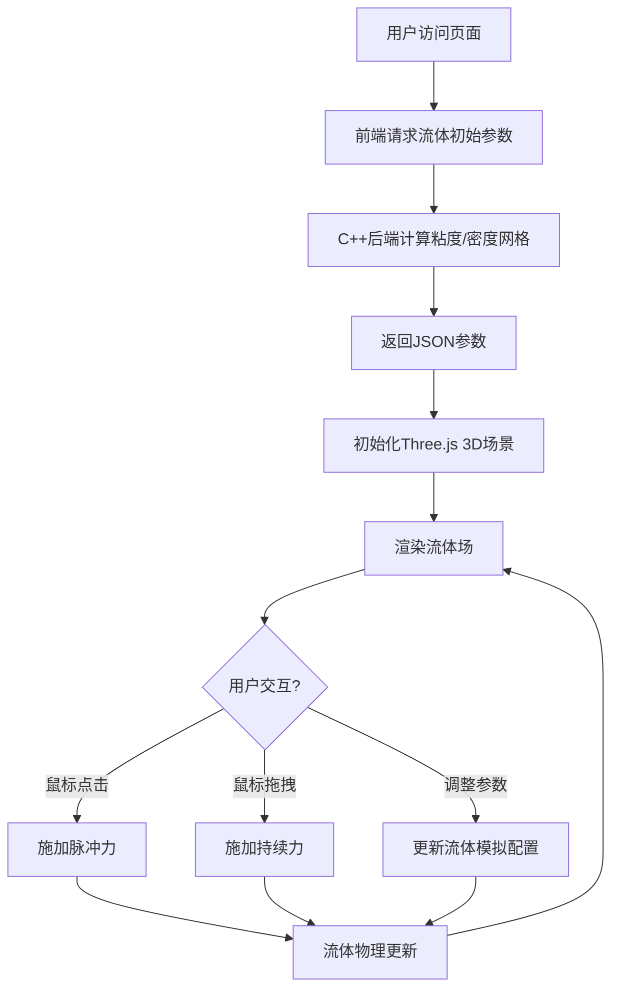

## 1. 产品概述

3D流体交互可视化平台，用户可通过鼠标点击和拖拽与实时3D流体场进行互动，体验物理模拟的动态效果。后端使用C++高性能计算流体初始参数，前端通过WebGL渲染流体动态效果。

- 主要用途：科学可视化展示、物理模拟教学、交互式艺术体验
- 目标用户：对物理模拟感兴趣的开发者、学生和艺术创作者
- 产品价值：结合高性能后端计算与前端实时渲染，提供流畅的流体交互体验

## 2. 核心功能

### 2.1 用户角色
| 角色 | 注册方式 | 核心权限 |
|------|----------|----------|
| 访客用户 | 无需注册 | 访问3D流体场景、进行鼠标交互、调整模拟参数 |

### 2.2 功能模块
1. **3D流体场景页面**：流体场渲染画布、控制面板、交互提示
2. **参数配置面板**：粘度、密度、阻尼系数调整
3. **交互系统**：鼠标点击施加脉冲力、鼠标拖拽施加持续力

### 2.3 页面详情
| 页面名称 | 模块名称 | 功能描述 |
|---------|----------|----------|
| 3D流体主场景 | 流体渲染画布 | WebGL渲染的3D流体场，支持旋转视角、缩放操作 |
| 3D流体主场景 | 控制面板 | 显示当前模拟参数，提供重置和参数调节功能 |
| 3D流体主场景 | 交互状态显示 | 实时显示鼠标位置、施加力度、流体速度等信息 |
| 3D流体主场景 | 加载状态 | 后端参数获取时的加载动画和状态提示 |

## 3. 核心流程

用户进入页面后，前端首先向C++后端请求流体模拟初始参数，获取后初始化3D流体场。用户通过鼠标与流体场交互，点击时在对应位置施加脉冲力，拖拽时沿鼠标轨迹施加持续力。流体实时更新并渲染，参数面板可随时调整模拟特性。

## 4. 用户界面设计

### 4.1 设计风格
- **主色调**：深空蓝 (#0a1628) 作为背景，配合霓虹青色 (#00f5d4) 作为流体主色，辅以紫色渐变 (#9b5de5) 作为交互高亮
- **按钮风格**：半透明玻璃拟态按钮，圆角8px，悬停时发光效果
- **字体**：标题使用 Space Grotesk，正文使用 JetBrains Mono，营造科技感和未来感
- **布局风格**：沉浸式全屏3D画布，浮动半透明控制面板，无遮挡式交互
- **视觉元素**：流体粒子使用发光效果，交互点产生涟漪动画，背景使用星空渐变

### 4.2 页面设计概述
| 页面名称 | 模块名称 | UI元素 |
|---------|----------|--------|
| 3D流体主场景 | 流体渲染画布 | 全屏WebGL渲染、3D粒子流体、发光材质、相机自动旋转 |
| 3D流体主场景 | 控制面板 | 左上角浮动面板、参数滑块、状态指标、重置按钮 |
| 3D流体主场景 | 交互提示 | 右下角帮助提示、鼠标光标自定义样式、交互时的视觉反馈 |
| 3D流体主场景 | 加载状态 | 居中加载动画、进度条、参数获取状态 |

### 4.3 响应式
- Desktop-first 设计，全屏沉浸式体验
- 控制面板在移动端自动调整为底部抽屉式布局
- 触摸操作支持：单指拖拽施力，双指旋转视角

### 4.4 3D场景指导
- **环境/氛围**：深空宇宙风格，深色背景配合粒子发光效果，营造神秘科技感
- **光照设置**：使用点光源配合环境光，流体粒子自发光材质，交互点产生动态光照
- **相机设置**：PerspectiveCamera，初始位置(0, 0, 15)，支持OrbitControls轨道控制
- **构图与焦点**：流体场位于画面中心，控制面板位于边缘不遮挡主场景
- **交互与动画**：流体粒子基于速度场运动，鼠标交互产生力场涟漪，参数变化平滑过渡
- **后期处理**：Bloom泛光效果、轻微噪点、颜色分级
- **性能预算**：粒子数量控制在5000-10000，60fps目标帧率
