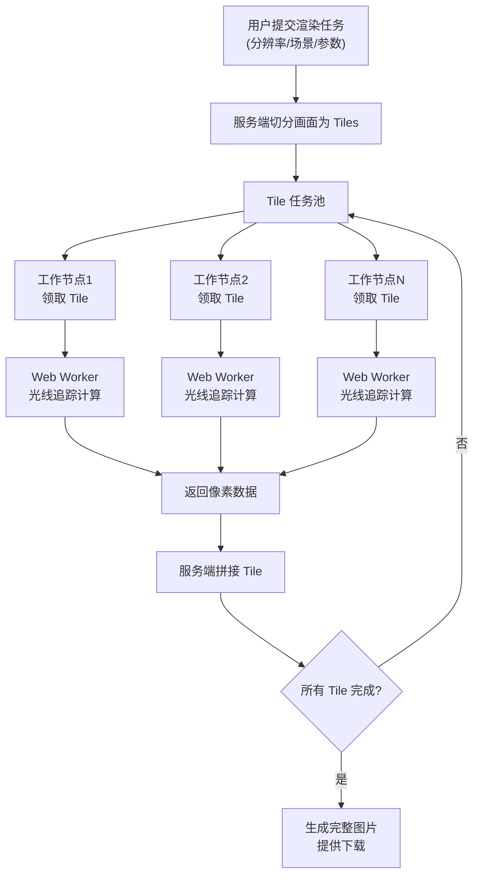

## 1. 产品概述

分布式 3D 渲染系统，采用主从架构将大分辨率光线追踪任务分发到多个浏览器工作节点并行计算，显著缩短渲染时间。利用 Web Worker 技术在浏览器后台进行像素级计算，实现零安装的分布式计算网络。

- **核心价值**：充分利用闲置的浏览器算力，低成本构建分布式渲染集群
- **目标用户**：需要高性能渲染但缺乏专业硬件的开发者、设计师、研究人员
- **解决问题**：单机光线追踪渲染速度慢，专业渲染集群成本高

## 2. 核心功能

### 2.1 用户角色

| 角色 | 接入方式 | 核心权限 |
|------|----------|----------|
| 任务发布者 | 访问服务端管理页 | 提交渲染任务、配置参数、查看进度、下载结果 |
| 计算节点 | 访问客户端页面 | 自动领取任务、本地计算、提交结果、查看贡献统计 |

### 2.2 功能模块

1. **服务端管理面板**：任务提交、渲染进度监控、节点状态管理、结果预览下载
2. **工作节点页面**：自动连接服务端、任务领取、Web Worker 计算、结果上传、算力统计
3. **光线追踪引擎**：基于 Web Worker 的纯 JavaScript 光线追踪渲染器
4. **Tile 调度系统**：智能切分渲染区域、动态任务分配、失败重试机制

### 2.3 页面详情

| 页面名称 | 模块名称 | 功能描述 |
|---------|---------|----------|
| 服务端管理面板 | 任务提交区 | 配置渲染分辨率、场景参数、Tile 大小、最大反弹次数 |
| 服务端管理面板 | 实时监控区 | 显示总进度条、已完成/进行中 Tile 网格热力图、在线节点列表 |
| 服务端管理面板 | 结果预览区 | 渐进式显示已完成的 Tile 拼接效果、支持下载完整图片 |
| 工作节点页面 | 连接状态区 | 显示与服务端的连接状态、当前任务信息 |
| 工作节点页面 | 计算状态区 | 显示当前 Tile 渲染进度、已完成任务数、累计贡献渲染时长 |
| 工作节点页面 | 实时预览区 | 显示当前正在计算的 Tile 的实时渲染效果 |

## 3. 核心流程

1. 任务发布者在管理面板配置渲染参数并提交任务
2. 服务端将大分辨率画面切分为多个等大小的 Tile
3. 各工作节点自动从任务池领取空闲 Tile
4. Web Worker 在后台进行光线追踪像素计算
5. 计算完成后将像素数据回传给服务端
6. 服务端收集所有 Tile 数据并渐进式拼接
7. 全部完成后生成完整图片供下载

## 4. 用户界面设计

### 4.1 设计风格

- **主色调**：深邃科技蓝 `#0a192f` 搭配霓虹青 `#64ffda`，营造高性能计算氛围
- **辅助色**：进度条使用渐变青蓝，警告状态使用琥珀色 `#f59e0b`，错误状态使用珊瑚红 `#f43f5e`
- **按钮风格**：圆角 8px，玻璃态半透明背景，悬停时有发光效果
- **字体**：标题使用 `Space Mono` 等宽字体，正文使用 `Inter`，突出技术感
- **布局**：深色主题，网格化信息面板，数据可视化优先
- **视觉细节**：使用代码编辑器风格的等宽字体显示数据，矩阵式 Tile 网格预览

### 4.2 页面设计概述

| 页面名称 | 模块名称 | UI 元素 |
|---------|---------|---------|
| 服务端管理面板 | 任务提交区 | 深色玻璃态表单、数字输入框带步进器、滑块控件、发光提交按钮 |
| 服务端管理面板 | 实时监控区 | 大尺寸进度条（带百分比数字）、SVG 网格热力图（按完成度着色）、节点卡片列表 |
| 服务端管理面板 | 结果预览区 | Canvas 渐进式拼接预览、下载按钮带文件大小信息 |
| 工作节点页面 | 连接状态区 | 脉冲动画连接指示灯、服务端地址输入、连接/断开按钮 |
| 工作节点页面 | 计算状态区 | 环形进度指示器、统计数据卡片（任务数、时长、平均速度） |
| 工作节点页面 | 实时预览区 | Canvas 显示当前渲染 Tile、像素级放大预览 |

### 4.3 响应性

- 桌面端优先设计，管理面板使用三栏布局
- 移动端自适应为单栏流式布局，隐藏次要统计信息
- 工作节点页面针对手机浏览器优化，降低动画复杂度以节省性能

### 4.4 3D 场景指导

- **内置测试场景**：经典 Cornell 盒子场景，包含漫反射墙面、镜面球体、玻璃球体
- **光照**：区域光源 + 环境光，支持软阴影和全局光照
- **相机**：可配置视角、焦距、光圈大小，支持景深效果
- **材质**：支持漫反射、金属、玻璃、发光四种基础材质
- **后期处理**：简单色调映射和伽马校正
