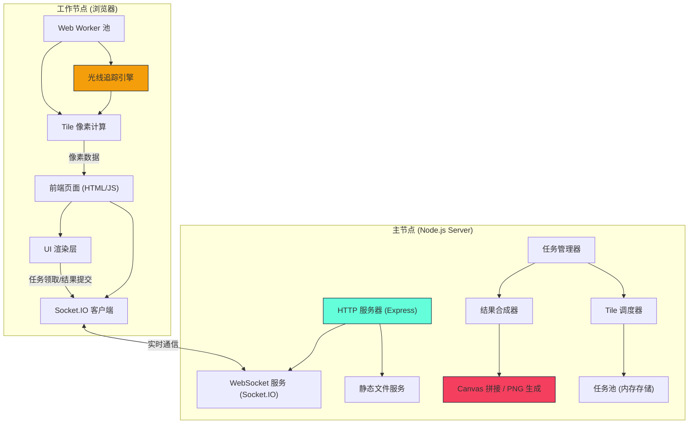
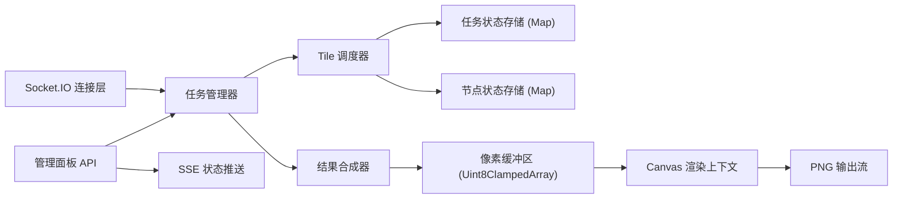
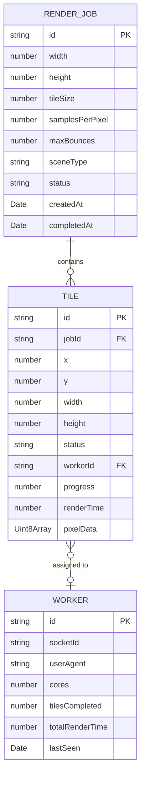

## 1. 架构设计



## 2. 技术描述

### 2.1 技术栈选择

- **服务端**：Node.js + Express + Socket.IO
  - `express@4` - HTTP 服务器和静态文件服务
  - `socket.io@4` - 实时双向通信
  - `canvas@2` - 服务端图片拼接和 PNG 生成
  - `sharp`（备选）- 高性能图片处理

- **前端**：原生 HTML/CSS/JavaScript（无框架）
  - 原生 Web Worker API - 后台计算
  - 原生 Canvas API - 客户端预览
  - Socket.IO 客户端 - 实时通信
  - 原生 CSS 变量和动画 - UI 效果

### 2.2 关键技术决策

1. **无前端框架**：工作节点需在浏览器中轻量化运行，避免框架开销
2. **WebSocket 通信**：确保任务分发和结果提交的低延迟
3. **Web Worker 池**：根据 CPU 核心数自动创建 Worker，最大化算力利用
4. **内存存储**：任务状态和 Tile 数据存储在内存中，简化架构
5. **纯 JS 光线追踪**：无需 WebGL，兼容性更好，便于在 Worker 中运行

## 3. 路由定义

| 路由 | 方法 | 用途 |
|-----|------|------|
| `/` | GET | 服务端管理面板页面 |
| `/worker` | GET | 工作节点页面 |
| `/result.png` | GET | 下载最终渲染结果 |
| `/socket.io/` | - | Socket.IO 通信端点 |

## 4. API 定义

### 4.1 Socket.IO 事件

```typescript
// 客户端 -> 服务端
interface WorkerJoin {
  workerId: string;
  cores: number;
}

interface RequestTask {
  workerId: string;
}

interface SubmitTile {
  workerId: string;
  tileId: string;
  pixelData: number[];  // RGBA 平铺数组
  renderTime: number;
}

interface WorkerStatus {
  workerId: string;
  currentTileId: string | null;
  progress: number;  // 0-100
}

// 服务端 -> 客户端
interface TaskAssigned {
  tileId: string;
  x: number;       // Tile 在画面中的起始 x
  y: number;       // Tile 在画面中的起始 y
  width: number;   // Tile 宽度
  height: number;  // Tile 高度
  scene: SceneConfig;
  renderParams: RenderParams;
}

interface TaskCancelled {
  tileId: string;
}

interface JobStatus {
  jobId: string;
  totalTiles: number;
  completedTiles: number;
  activeWorkers: number;
  tiles: TileStatus[];
}

// 配置类型
interface SceneConfig {
  type: 'cornell' | 'spheres';
  camera: {
    eye: [number, number, number];
    lookAt: [number, number, number];
    fov: number;
  };
}

interface RenderParams {
  width: number;
  height: number;
  samplesPerPixel: number;
  maxBounces: number;
}

interface TileStatus {
  id: string;
  x: number;
  y: number;
  width: number;
  height: number;
  status: 'pending' | 'assigned' | 'completed';
  workerId?: string;
  progress?: number;
}
```

## 5. 服务端架构



### 核心模块职责

- **Tile 调度器**：实现工作窃取算法，优先分配相邻 Tile 给同一节点，失败自动重试
- **结果合成器**：维护完整画面的像素缓冲区，收到 Tile 后立即写入对应位置
- **状态管理器**：跟踪所有 Tile 和节点状态，支持查询和推送更新

## 6. 数据模型

### 6.1 数据模型定义



### 6.2 内存数据结构

```javascript
// 任务存储
const jobs = new Map<string, RenderJob>();

// Tile 存储 (按 jobId 分组)
const tilesByJob = new Map<string, Map<string, Tile>>();

// 待分配 Tile 队列
const pendingTiles = new Map<string, string[]>();  // jobId -> tileId[]

// 节点存储
const workers = new Map<string, Worker>();

// 完整画面像素缓冲区
const pixelBuffers = new Map<string, Uint8ClampedArray>();  // jobId -> buffer
```
