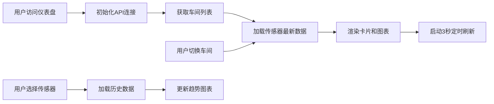

## 1. 产品概述

物联网传感器实时监控仪表盘，面向工厂运维管理人员，实时展示各车间传感器的温度、震动频率、电压数据，及时发现设备异常，保障生产安全。

## 2. 核心功能

### 2.1 用户角色

| 角色 | 注册方式 | 核心权限 |
|------|----------|----------|
| 运维管理员 | 无需注册，直接访问 | 查看所有车间传感器实时数据和历史趋势 |

### 2.2 功能模块

1. **实时监控总览**：车间概览卡片、全局统计指标、异常告警提示
2. **传感器状态详情**：各传感器实时数值卡片、状态指示器、趋势图表
3. **历史趋势分析**：温度/震动/电压历史折线图、时间范围选择
4. **车间切换导航**：车间标签页切换、传感器筛选

### 2.3 页面详情

| 页面名称 | 模块名称 | 功能描述 |
|----------|----------|----------|
| 实时监控仪表盘 | 顶部状态栏 | 显示系统标题、最后更新时间、在线传感器数量 |
| 实时监控仪表盘 | 全局统计区 | 展示平均温度、平均震动、平均电压、异常传感器数量 |
| 实时监控仪表盘 | 车间导航区 | 车间标签切换、传感器下拉筛选 |
| 实时监控仪表盘 | 传感器卡片网格 | 每个卡片展示传感器ID、温度、震动、电压数值及状态 |
| 实时监控仪表盘 | 趋势图表区 | 三个独立折线图分别展示温度、震动、电压的历史趋势 |
| 实时监控仪表盘 | 异常告警区 | 滚动展示最新的异常数据记录 |

## 3. 核心流程

用户打开仪表盘页面后，系统自动连接后端API获取最新传感器数据，每3秒刷新一次。用户可通过车间标签切换查看不同车间的数据，点击传感器卡片查看详细历史趋势。

## 4. 用户界面设计

### 4.1 设计风格

- **主色调**：深色工业风，主色 `#0ea5e9`（科技蓝），辅色 `#10b981`（绿色正常）、`#f59e0b`（橙色警告）、`#ef4444`（红色异常）
- **背景**：深灰色渐变 `#0f172a` 到 `#1e293b`，带细微网格纹理
- **卡片**：半透明深色玻璃态，带微妙边框和阴影
- **字体**：标题使用 `Orbitron`（科技感等宽字体），正文使用 `Inter`
- **布局**：网格布局，固定侧边车间导航，主内容区自适应
- **图标**：使用 Lucide 图标，线条风格，统一 24px 尺寸

### 4.2 页面设计概览

| 页面名称 | 模块名称 | UI 元素 |
|----------|----------|----------|
| 实时监控仪表盘 | 顶部状态栏 | 深色渐变背景、发光标题、实时时钟脉冲动画 |
| 实时监控仪表盘 | 全局统计区 | 四个指标卡片，数值带动效翻转变换，状态颜色编码 |
| 实时监控仪表盘 | 传感器卡片 | 圆角矩形、三色状态指示器、数值大号显示、迷你趋势线 |
| 实时监控仪表盘 | 趋势图表 | ECharts 折线图、渐变填充、实时数据点闪烁 |
| 实时监控仪表盘 | 异常告警 | 滚动列表、红色高亮、告警图标闪烁动画 |

### 4.3 响应式

- 桌面端（>1200px）：四列传感器卡片网格，侧边车间导航固定
- 平板端（768-1200px）：两列传感器卡片网格，顶部车间导航
- 移动端（<768px）：单列传感器卡片，底部弹出式车间选择器

### 4.4 动效设计

- 页面加载：元素从上到下渐入，带微妙延迟错位
- 数据更新：数值变化时带数字滚动动画，异常状态卡片呼吸闪烁
- 卡片悬停：轻微上浮 + 发光边框效果
- 告警提示：新异常出现时从右侧滑入，带警告音效提示（可选）
