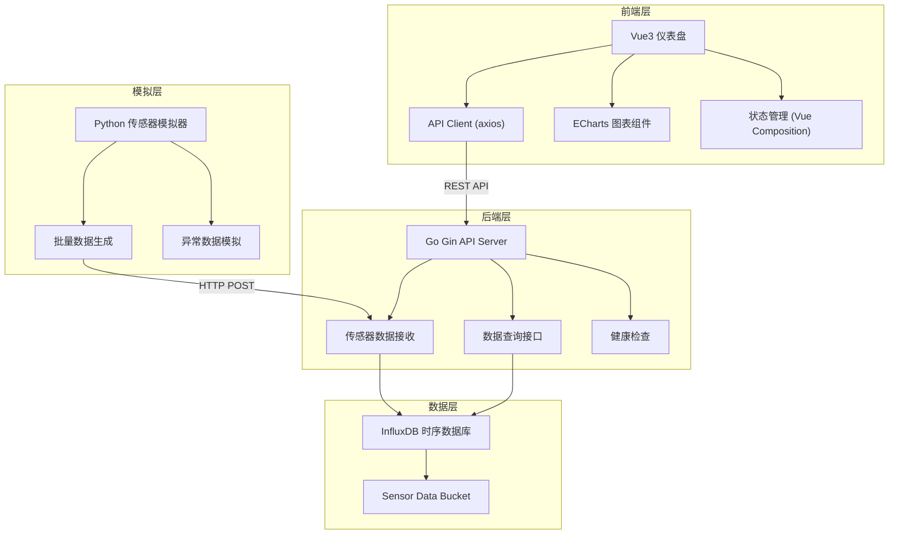
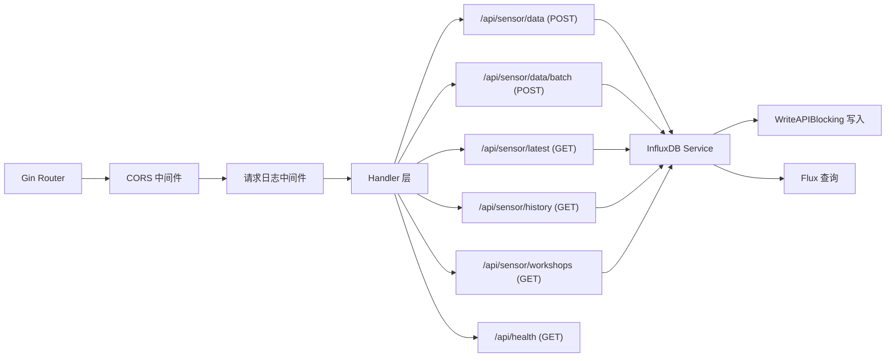

## 1. 架构设计



## 2. 技术描述

- **前端**：Vue@3.4 + TypeScript + Vite@5 + TailwindCSS@3 + Vue Router@4 + ECharts@5 + axios
- **初始化工具**：vite-init vue-ts 模板
- **后端**：Go@1.22 + Gin@1.10 + InfluxDB Client v2
- **数据库**：InfluxDB 2.7（时序数据库）
- **模拟层**：Python@3.12 + requests
- **容器编排**：Docker Compose

## 3. 路由定义

| 路由 | 用途 |
|------|------|
| / | 实时监控仪表盘首页 |
| /workshop/:id | 指定车间详情页 |
| /sensor/:workshop/:sensorId | 传感器历史详情页 |

## 4. API 定义

```typescript
interface SensorData {
  workshop: string;
  sensorId: string;
  temperature: number;
  vibration: number;
  voltage: number;
  timestamp: string;
}

interface ApiResponse<T> {
  code: number;
  message: string;
  data: T;
}

// GET /api/sensor/latest
interface LatestDataResponse {
  [workshop: string]: {
    [sensorId: string]: SensorData;
  };
}

// GET /api/sensor/history?workshop=xxx&sensorId=xxx&hours=24
interface HistoryDataResponse {
  data: SensorData[];
}

// GET /api/sensor/workshops
interface WorkshopsResponse {
  workshops: string[];
}

// POST /api/sensor/data
interface PostDataRequest extends SensorData {}

// POST /api/sensor/data/batch
interface BatchDataRequest {
  data: SensorData[];
}
```

## 5. 服务器架构



## 6. 数据模型

### 6.1 InfluxDB 数据模型

```
Measurement: sensor_data
  Tags:
    - workshop (车间标识)
    - sensorId (传感器ID)
  Fields:
    - temperature (float, 温度 °C)
    - vibration (float, 震动频率 Hz)
    - voltage (float, 电压 V)
  Timestamp: RFC3339 时间戳
```

### 6.2 Flux 查询示例

查询最新数据：
```flux
from(bucket: "sensor_data")
  |> range(start: -1h)
  |> filter(fn: (r) => r._measurement == "sensor_data")
  |> group(columns: ["workshop", "sensorId"])
  |> last()
  |> pivot(rowKey:["_time"], columnKey: ["_field"], valueColumn: "_value")
```

查询历史数据：
```flux
from(bucket: "sensor_data")
  |> range(start: -24h)
  |> filter(fn: (r) => r._measurement == "sensor_data")
  |> filter(fn: (r) => r.workshop == "workshop-a")
  |> filter(fn: (r) => r.sensorId == "sensor-001")
  |> pivot(rowKey:["_time"], columnKey: ["_field"], valueColumn: "_value")
  |> sort(columns: ["_time"])
```
