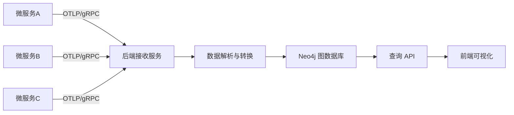
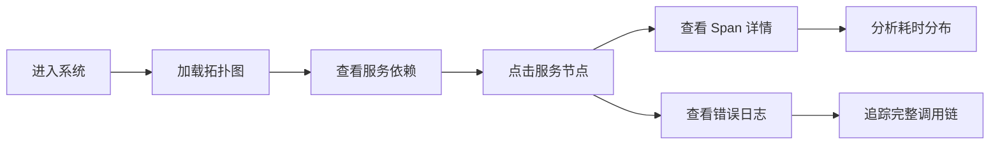

## 1. 产品概述

微服务调用链路追踪系统，用于可视化展示微服务架构中各服务间的调用关系、性能指标和错误日志。系统接收 OpenTelemetry 格式的 Trace 数据，存储于图数据库，通过交互式拓扑图帮助开发人员快速定位性能瓶颈和故障点。

- **主要目的**：解决微服务架构下的链路追踪可视化难题，提升问题排查效率
- **目标用户**：后端开发工程师、运维工程师、架构师
- **产品价值**：直观呈现服务依赖关系，快速定位错误源头，量化分析调用性能

## 2. 核心功能

### 2.1 功能模块

1. **服务拓扑图页面**：全局服务调用关系可视化、节点状态展示、筛选控制
2. **Span 详情面板**：点击节点展示调用链详情、耗时分析、时序瀑布图
3. **错误日志面板**：错误统计、错误详情展示、错误关联追踪
4. **数据接收接口**：OpenTelemetry OTLP 格式数据接入、实时数据处理

### 2.2 页面详情

| 页面名称 | 模块名称 | 功能描述 |
|---------|---------|----------|
| 拓扑图主页面 | 拓扑画布 | G6 渲染的力导向图，展示服务节点和调用边 |
| 拓扑图主页面 | 控制面板 | 时间范围选择、服务筛选、刷新按钮、布局切换 |
| 拓扑图主页面 | 统计概览 | 服务总数、调用总量、错误率、平均响应时间 |
| Span 详情面板 | 调用链列表 | 展示选中服务的所有入站/出站调用 |
| Span 详情面板 | 耗时分析 | 每个 Span 的耗时柱状图、P95/P99 延迟统计 |
| Span 详情面板 | 瀑布图 | 调用链时序瀑布图，展示父子调用关系 |
| 错误日志面板 | 错误概览 | 错误数量趋势、错误类型分布 |
| 错误日志面板 | 错误详情 | 错误堆栈、发生时间、关联 Trace ID |

## 3. 核心流程

### 3.1 数据采集流程
微服务通过 OpenTelemetry SDK 上报 Trace 数据 → 后端 OTLP 接收接口解析数据 → 转换为图数据模型 → 存入 Neo4j 图数据库 → 前端查询并可视化展示。

### 3.2 用户操作流程
用户进入系统 → 查看全局服务拓扑图 → 点击感兴趣的服务节点 → 查看该服务的 Span 详情和耗时分析 → 切换到错误日志面板查看错误详情 → 根据 Trace ID 追踪完整调用链。

## 4. 用户界面设计

### 4.1 设计风格
- **主色调**：深空蓝 (#0F172A) 作为背景，科技感蓝 (#3B82F6) 作为主色，警告橙 (#F59E0B) 标记警告，错误红 (#EF4444) 标记错误
- **按钮样式**：圆角矩形、悬浮发光效果、点击微缩放
- **字体**：主标题使用 Orbitron 科技感字体，正文使用 JetBrains Mono 等宽字体，确保代码类内容可读性
- **布局风格**：深色科技风、三栏布局（左侧控制面板 + 中央拓扑图 + 右侧详情面板）、玻璃拟态效果
- **视觉元素**：网格背景、发光节点、脉冲动画、渐变连线

### 4.2 页面设计概述

| 页面名称 | 模块名称 | UI 元素 |
|---------|---------|---------|
| 拓扑图主页面 | 顶部导航 | Logo、系统标题、时间范围选择器、刷新按钮 |
| 拓扑图主页面 | 左侧面板 | 服务列表筛选、状态筛选（正常/警告/错误）、图例说明 |
| 拓扑图主页面 | 中央画布 | G6 力导向图、节点悬浮高亮、点击选中效果、连线动画 |
| 拓扑图主页面 | 右侧面板 | Tab 切换（Span 详情 / 错误日志）、数据表格、图表 |
| 拓扑图主页面 | 底部状态栏 | 实时数据接入状态、节点/边数量统计、加载进度 |

### 4.3 响应式
- **桌面端优先**：1920×1080 及以上分辨率，三栏完整布局
- **平板适配**：1024-1919px，左右面板可折叠收起
- **移动适配**：768-1023px，单栏堆叠布局，面板通过抽屉形式展示

### 4.4 交互与动画
- 页面加载时拓扑图节点逐个淡入，形成级联动画
- 节点悬浮时放大 1.2 倍并发出光晕，连线高亮
- 节点选中状态有持续呼吸灯动画
- 错误节点有红色脉冲警告动画
- 面板切换使用滑动过渡动画
