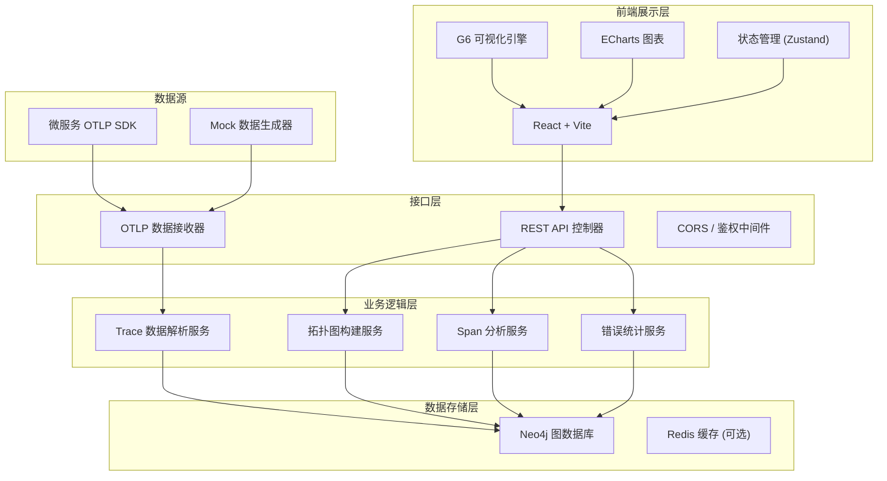
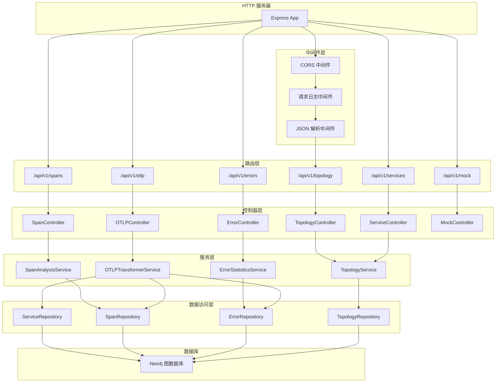
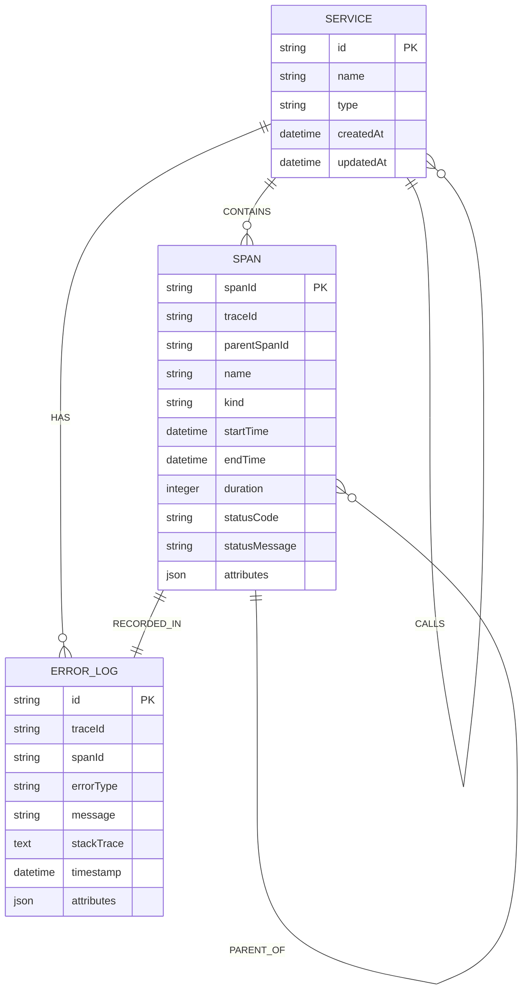

## 1. 架构设计

### 1.1 系统分层架构



### 1.2 核心架构特点
- **前后端分离**：前端独立部署，通过 REST API 与后端交互
- **图数据库存储**：使用 Neo4j 存储服务节点和调用关系，天然适合拓扑查询
- **OpenTelemetry 兼容**：支持标准 OTLP 协议，可无缝接入现有微服务体系
- **实时数据处理**：数据接收即处理，秒级更新拓扑图
- **可扩展设计**：模块化架构，支持后续接入 NebulaGraph 等其他图数据库

## 2. 技术描述

### 2.1 前端技术栈
- **框架**：React@18 + TypeScript@5
- **构建工具**：Vite@5
- **样式方案**：TailwindCSS@3 + CSS 变量
- **可视化引擎**：@antv/g6@4 (用于拓扑图渲染)
- **图表库**：echarts@5 (用于耗时分析、错误趋势图)
- **状态管理**：zustand@4 (轻量级状态管理)
- **HTTP 客户端**：axios@1
- **UI 组件**：自定义组件 + lucide-react 图标库

### 2.2 后端技术栈
- **运行时**：Node.js@20
- **Web 框架**：Express@4
- **类型系统**：TypeScript@5
- **图数据库驱动**：neo4j-driver@5
- **OTLP 协议支持**：@opentelemetry/api@1 + @opentelemetry/otlp-transformer@0
- **数据验证**：zod@3
- **CORS 处理**：cors@2
- **开发工具**：ts-node-dev + concurrently

### 2.3 数据库选择
- **主数据库**：Neo4j Community Edition 5.x
- **备选方案**：NebulaGraph 3.x (可通过 Repository 模式切换)
- **数据模型**：
  - 节点 Label: `Service` (服务节点)、`Span` (调用 Span)
  - 关系类型: `CALLS` (服务间调用)、`CONTAINS` (服务包含 Span)、`PARENT_OF` (Span 父子关系)

### 2.4 项目初始化方式
- 使用 npm create vite@latest 初始化前端项目
- 使用 npm init -y 初始化后端项目，手动配置 TypeScript
- 使用 concurrently 同时启动前后端开发服务器

## 3. 目录结构

### 3.1 前端目录结构
```
frontend/
├── src/
│   ├── components/          # React 组件
│   │   ├── TopologyGraph/   # 拓扑图组件
│   │   ├── SpanPanel/       # Span 详情面板
│   │   ├── ErrorPanel/      # 错误日志面板
│   │   ├── ControlPanel/    # 控制面板
│   │   └── common/          # 通用组件
│   ├── stores/              # Zustand 状态管理
│   ├── services/            # API 服务
│   ├── types/               # TypeScript 类型定义
│   ├── utils/               # 工具函数
│   ├── hooks/               # 自定义 Hooks
│   ├── App.tsx
│   ├── main.tsx
│   └── index.css
├── public/
├── index.html
├── package.json
├── tsconfig.json
├── vite.config.ts
└── tailwind.config.js
```

### 3.2 后端目录结构
```
backend/
├── src/
│   ├── controllers/         # API 控制器
│   ├── services/            # 业务逻辑
│   ├── repositories/        # 数据访问层
│   ├── models/              # 数据模型
│   ├── routes/              # 路由定义
│   ├── middleware/          # 中间件
│   ├── types/               # TypeScript 类型
│   ├── config/              # 配置
│   ├── server.ts            # 服务器入口
│   └── app.ts               # Express 应用
├── scripts/                 # 脚本 (Mock 数据生成等)
├── package.json
├── tsconfig.json
└── .env.example
```

## 4. 路由定义

| 路由 | 方法 | 用途 |
|-----|------|------|
| / | GET | 前端页面入口 (由 Vite 提供) |
| /api/health | GET | 健康检查 |
| /api/v1/topology | GET | 获取服务拓扑图数据 |
| /api/v1/services | GET | 获取服务列表 |
| /api/v1/services/:serviceId/spans | GET | 获取指定服务的 Span 列表 |
| /api/v1/spans/:spanId | GET | 获取 Span 详情 |
| /api/v1/traces/:traceId | GET | 获取完整 Trace 调用链 |
| /api/v1/services/:serviceId/errors | GET | 获取指定服务的错误列表 |
| /api/v1/errors/:errorId | GET | 获取错误详情 |
| /api/v1/otlp/v1/traces | POST | OTLP Trace 数据接收接口 |
| /api/v1/mock/generate | POST | 生成 Mock 测试数据 |

## 5. API 数据模型定义

### 5.1 服务节点 (ServiceNode)
```typescript
interface ServiceNode {
  id: string;           // 服务唯一标识
  name: string;         // 服务名称
  type: string;         // 服务类型 (http, grpc, database, etc.)
  status: 'healthy' | 'warning' | 'error';
  callCount: number;    // 总调用次数
  errorCount: number;   // 错误次数
  avgLatency: number;   // 平均延迟 (ms)
  p95Latency: number;   // P95 延迟
  p99Latency: number;   // P99 延迟
  lastActive: string;   // 最后活跃时间
}
```

### 5.2 调用边 (CallEdge)
```typescript
interface CallEdge {
  id: string;
  source: string;       // 源服务 ID
  target: string;       // 目标服务 ID
  callCount: number;    // 调用次数
  errorCount: number;   // 错误次数
  avgLatency: number;   // 平均延迟
  minLatency: number;   // 最小延迟
  maxLatency: number;   // 最大延迟
}
```

### 5.3 Span 数据 (Span)
```typescript
interface Span {
  id: string;           // Span ID
  traceId: string;      // Trace ID
  parentSpanId?: string; // 父 Span ID
  serviceName: string;  // 所属服务
  name: string;         // Span 名称
  kind: 'internal' | 'server' | 'client' | 'producer' | 'consumer';
  startTime: string;    // 开始时间
  endTime: string;      // 结束时间
  duration: number;     // 持续时间 (ns)
  statusCode: 'UNSET' | 'OK' | 'ERROR';
  statusMessage?: string;
  attributes: Record<string, any>;
  events?: SpanEvent[];
}

interface SpanEvent {
  time: string;
  name: string;
  attributes: Record<string, any>;
}
```

### 5.4 错误数据 (ErrorLog)
```typescript
interface ErrorLog {
  id: string;
  traceId: string;
  spanId: string;
  serviceName: string;
  errorType: string;    // 错误类型
  message: string;      // 错误信息
  stackTrace?: string;  // 堆栈信息
  timestamp: string;    // 发生时间
  attributes: Record<string, any>;
}
```

### 5.5 拓扑图数据 (TopologyData)
```typescript
interface TopologyData {
  nodes: ServiceNode[];
  edges: CallEdge[];
  statistics: {
    totalServices: number;
    totalCalls: number;
    totalErrors: number;
    errorRate: number;
    avgLatency: number;
  };
}
```

## 6. 服务器架构图



## 7. 数据模型

### 7.1 Neo4j 图数据模型



### 7.2 Neo4j 索引定义
```cypher
// 服务节点索引
CREATE INDEX idx_service_id FOR (s:Service) ON (s.id);
CREATE INDEX idx_service_name FOR (s:Service) ON (s.name);

// Span 索引
CREATE INDEX idx_span_id FOR (sp:Span) ON (sp.spanId);
CREATE INDEX idx_span_trace_id FOR (sp:Span) ON (sp.traceId);
CREATE INDEX idx_span_service FOR (sp:Span) ON (sp.serviceName);
CREATE INDEX idx_span_start_time FOR (sp:Span) ON (sp.startTime);

// 错误日志索引
CREATE INDEX idx_error_id FOR (e:ErrorLog) ON (e.id);
CREATE INDEX idx_error_service FOR (e:ErrorLog) ON (e.serviceName);
CREATE INDEX idx_error_trace_id FOR (e:ErrorLog) ON (e.traceId);
CREATE INDEX idx_error_timestamp FOR (e:ErrorLog) ON (e.timestamp);

// 关系索引
CREATE INDEX idx_calls_time FOR ()-[r:CALLS]->() ON (r.timestamp);
```

## 8. 部署与配置

### 8.1 环境变量配置
```bash
# .env.example
# 服务器配置
SERVER_PORT=3001
NODE_ENV=development

# Neo4j 配置
NEO4J_URI=bolt://localhost:7687
NEO4J_USER=neo4j
NEO4J_PASSWORD=neo4j123

# OTLP 配置
OTLP_HTTP_PORT=4318
OTLP_GRPC_PORT=4317

# 缓存配置 (可选)
REDIS_URL=redis://localhost:6379

# 前端地址 (用于 CORS)
FRONTEND_ORIGIN=http://localhost:5173
```

### 8.2 启动命令
```bash
# 后端开发
cd backend && npm run dev

# 前端开发
cd frontend && npm run dev

# 同时启动前后端
npm run dev:all

# 构建生产版本
npm run build
```
